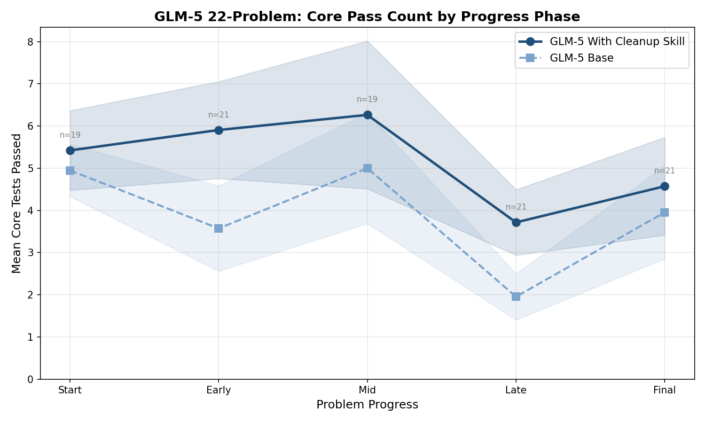
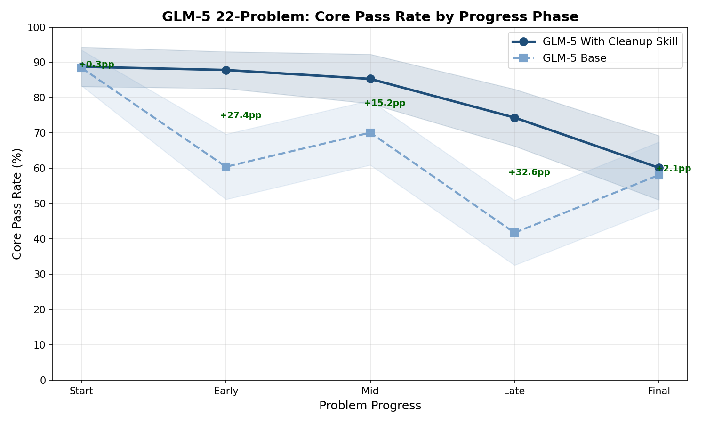
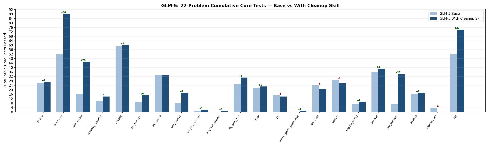
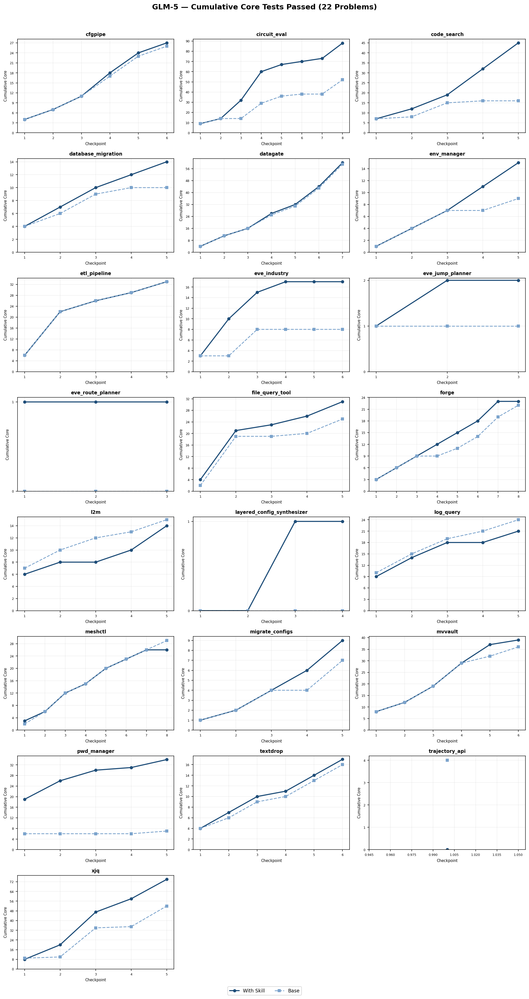
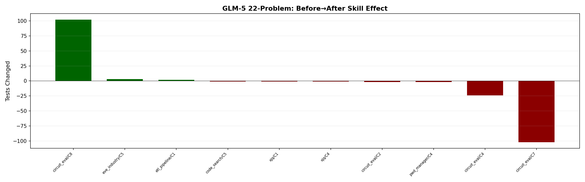

# GLM-5: 22-Problem Summary — Base vs With Cleanup Skill

## Overview

22 problems, 116 checkpoints. Comparing GLM-5 Base (no skill) vs GLM-5 With Cleanup Skill.

## Key Findings

1. **Skill run passes +31% more cumulative core tests than baseline**: Base 451 → Skill 591 (+140) across 22 problems
2. **17 out of 22 problems improved** with skill, 4 worsened, 1 unchanged
3. **Skill is safe (Before→After)**: 91% of checkpoints unchanged. 3 improved, 7 worsened
4. **Biggest gains**: circuit_eval +36, code_search +29, pwd_manager +27, xjq +22, eve_industry +9, env_manager +6
5. **Biggest losses**: trajectory_api -4, log_query -3, meshctl -3, l2m -1
6. **Mean Δ/CP across 22 problems: +1.00**

## Core Pass Rate by Progress Phase





## Charts







## Aggregate

| Metric | Value |
|--------|-------|
| Total cumulative core (Base) | 451 |
| Total cumulative core (Skill) | 591 |
| **Change** | **+140 (+31%)** |
| Problems improved | 17 |
| Problems worsened | 4 |
| Problems unchanged | 1 |

### Before → After (true skill effect)

| | Count | % |
|---|---:|---:|
| Same | 101 | 91% |
| 🟢 Improved | 3 | 3% |
| 🔴 Worsened | 7 | 6% |

**Improvements:**
- 🟢 circuit_eval/checkpoint_8: +102 tests (Regression +38, Regression +52, Regression +2, Regression +10)
- 🟢 etl_pipeline/checkpoint_1: +2 tests (Error +2)
- 🟢 eve_industry/checkpoint_5: +3 tests (Regression +1, Error +3, Functionality -1)

**Regressions:**
- 🔴 circuit_eval/checkpoint_2: -2 tests (Error -2)
- 🔴 circuit_eval/checkpoint_4: -24 tests (Regression -1, Regression -16, Core -1, Functionality -6)
- 🔴 circuit_eval/checkpoint_7: -102 tests (Regression -38, Regression -52, Regression -2, Regression -10)
- 🔴 code_search/checkpoint_5: -1 tests (Regression -1)
- 🔴 pwd_manager/checkpoint_4: -2 tests (Functionality -2)
- 🔴 xjq/checkpoint_1: -1 tests (Core -1)
- 🔴 xjq/checkpoint_4: -1 tests (Functionality -1)

## Per-Problem Cumulative Core Tests

| Problem | Base | Skill | Δ | CP | Δ/CP |
|---------|------|-------|---|-----|------|
| cfgpipe | 26 | 27 | 🟢 +1 | 6/6 | +0.17 |
| circuit_eval | 52 | 88 | 🟢 +36 | 8/8 | +4.50 |
| code_search | 16 | 45 | 🟢 +29 | 5/5 | +5.80 |
| database_migration | 10 | 14 | 🟢 +4 | 5/5 | +0.80 |
| datagate | 59 | 60 | 🟢 +1 | 7/7 | +0.14 |
| env_manager | 9 | 15 | 🟢 +6 | 5/5 | +1.20 |
| etl_pipeline | 33 | 33 | ⚪ 0 | 5/5 | 0.00 |
| eve_industry | 8 | 17 | 🟢 +9 | 6/6 | +1.50 |
| eve_jump_planner | 1 | 2 | 🟢 +1 | 3/3 | +0.33 |
| eve_route_planner | 0 | 1 | 🟢 +1 | 3/3 | +0.33 |
| file_query_tool | 25 | 31 | 🟢 +6 | 5/5 | +1.20 |
| forge | 22 | 23 | 🟢 +1 | 8/8 | +0.12 |
| l2m | 15 | 14 | 🔴 -1 | 5/5 | -0.20 |
| layered_config_synthesizer | 0 | 1 | 🟢 +1 | 4/4 | +0.25 |
| log_query | 24 | 21 | 🔴 -3 | 5/5 | -0.60 |
| meshctl | 29 | 26 | 🔴 -3 | 8/8 | -0.38 |
| migrate_configs | 7 | 9 | 🟢 +2 | 5/5 | +0.40 |
| mvvault | 36 | 39 | 🟢 +3 | 6/6 | +0.50 |
| pwd_manager | 7 | 34 | 🟢 +27 | 5/5 | +5.40 |
| textdrop | 16 | 17 | 🟢 +1 | 6/6 | +0.17 |
| trajectory_api | 4 | 0 | 🔴 -4 | 1/5 | -4.00 |
| xjq | 52 | 74 | 🟢 +22 | 5/5 | +4.40 |

---

## Run Paths

```
cfgpipe:
  baseline: outputs/glm-5-kimi/claude_code-2.0.51_baseline_20260602T2028/cfgpipe/
  review:   outputs/glm-5-kimi/claude_code-2.0.51_just-solve_none_20260601T2147/cfgpipe/

circuit_eval:
  baseline: outputs/glm-5-kimi/claude_code-2.0.51_baseline_20260608T1722/circuit_eval/
  review:   outputs/glm-5-kimi/claude_code-2.0.51_review_refactor_20260608T1722/circuit_eval/

code_search:
  baseline: outputs/glm-5-kimi/claude_code-2.0.51_baseline_20260604T2240/code_search/
  review:   outputs/glm-5-kimi/claude_code-2.0.51_just-solve_none_20260601T2147/code_search/

database_migration:
  baseline: outputs/glm-5-kimi/claude_code-2.0.51_baseline_20260604T2240/database_migration/
  review:   outputs/glm-5-kimi/claude_code-2.0.51_just-solve_none_20260601T2147/database_migration/

datagate:
  baseline: outputs/glm-5-kimi/claude_code-2.0.51_baseline_20260604T2240/datagate/
  review:   outputs/glm-5-kimi/claude_code-2.0.51_just-solve_none_20260601T2147/datagate/

env_manager:
  baseline: outputs/glm-5-kimi/claude_code-2.0.51_baseline_20260604T2240/env_manager/
  review:   outputs/glm-5-kimi/claude_code-2.0.51_review_refactor_20260604T2242/env_manager/

etl_pipeline:
  baseline: outputs/glm-5-kimi/claude_code-2.0.51_baseline_20260604T2240/etl_pipeline/
  review:   outputs/glm-5-kimi/claude_code-2.0.51_just-solve_none_20260601T2147/etl_pipeline/

eve_industry:
  baseline: outputs/glm-5-kimi/claude_code-2.0.51_baseline_20260604T2240/eve_industry/
  review:   outputs/glm-5-kimi/claude_code-2.0.51_just-solve_none_20260601T2147/eve_industry/

eve_jump_planner:
  baseline: outputs/glm-5-kimi/claude_code-2.0.51_baseline_20260604T2240/eve_jump_planner/
  review:   outputs/glm-5-kimi/claude_code-2.0.51_just-solve_none_20260601T2147/eve_jump_planner/

eve_route_planner:
  baseline: outputs/glm-5-kimi/claude_code-2.0.51_baseline_20260604T2240/eve_route_planner/
  review:   outputs/glm-5-kimi/claude_code-2.0.51_review_refactor_20260605T1540/eve_route_planner/

file_query_tool:
  baseline: outputs/glm-5-kimi/claude_code-2.0.51_baseline_20260608T1722/file_query_tool/
  review:   outputs/glm-5-kimi/claude_code-2.0.51_review_refactor_20260612T0122/file_query_tool/

forge:
  baseline: outputs/glm-5-kimi/claude_code-2.0.51_baseline_20260611T0212/forge/
  review:   outputs/glm-5-kimi/claude_code-2.0.51_review_refactor_20260611T0213/forge/

l2m:
  baseline: outputs/glm-5-kimi/claude_code-2.0.51_baseline_20260608T1722/l2m/
  review:   outputs/glm-5-kimi/claude_code-2.0.51_review_refactor_20260608T1722/l2m/

layered_config_synthesizer:
  baseline: outputs/glm-5-kimi/claude_code-2.0.51_baseline_20260608T1722/layered_config_synthesizer/
  review:   outputs/glm-5-kimi/claude_code-2.0.51_review_refactor_20260608T1722/layered_config_synthesizer/

log_query:
  baseline: outputs/glm-5-kimi/claude_code-2.0.51_baseline_20260608T1722/log_query/
  review:   outputs/glm-5-kimi/claude_code-2.0.51_review_refactor_20260611T2154/log_query/

meshctl:
  baseline: outputs/glm-5-kimi/claude_code-2.0.51_baseline_20260611T0212/meshctl/
  review:   outputs/glm-5-kimi/claude_code-2.0.51_review_refactor_20260611T2154/meshctl/

migrate_configs:
  baseline: outputs/glm-5-kimi/claude_code-2.0.51_baseline_20260608T1722/migrate_configs/
  review:   outputs/glm-5-kimi/claude_code-2.0.51_review_refactor_20260608T1722/migrate_configs/

mvvault:
  baseline: outputs/glm-5-kimi/claude_code-2.0.51_baseline_20260608T1722/mvvault/
  review:   outputs/glm-5-kimi/claude_code-2.0.51_review_refactor_20260610T1848/mvvault/

pwd_manager:
  baseline: outputs/glm-5-kimi/claude_code-2.0.51_baseline_20260608T1722/pwd_manager/
  review:   outputs/glm-5-kimi/claude_code-2.0.51_review_refactor_20260608T1722/pwd_manager/

textdrop:
  baseline: outputs/glm-5-kimi/claude_code-2.0.51_baseline_20260611T0212/textdrop/
  review:   outputs/glm-5-kimi/claude_code-2.0.51_review_refactor_20260611T0213/textdrop/

trajectory_api:
  baseline: outputs/glm-5-kimi/claude_code-2.0.51_baseline_20260611T0212/trajectory_api/
  review:   outputs/glm-5-kimi/claude_code-2.0.51_review_refactor_20260611T2154/trajectory_api/

xjq:
  baseline: outputs/glm-5-kimi/claude_code-2.0.51_baseline_20260611T0212/xjq/
  review:   outputs/glm-5-kimi/claude_code-2.0.51_review_refactor_20260611T0213/xjq/

```
