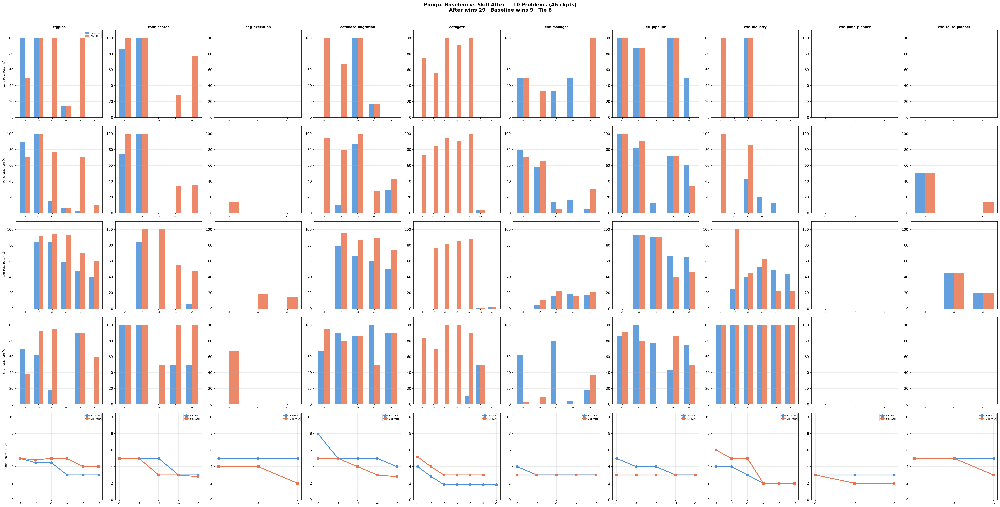

# Pangu: 10-Problem Full Comparison — Baseline vs Skill After

## Run Sources

| Problem | Baseline Run | Skill Run |
|---------|-------------|-----------|
| cfgpipe | baseline_20260603T1458 | review_refactor_20260602T0203 |
| code_search | baseline_20260603T0121 | review_refactor_20260602T0203 |
| dag_execution | baseline_20260603T1458 | review_refactor_20260602T0203 |
| database_migration | baseline_20260604T1405 | review_refactor_20260603T2011 |
| datagate | baseline_20260603T2011 | review_refactor_20260603T2011 |
| env_manager | baseline_20260604T1405 | review_refactor_20260604T1409 |
| etl_pipeline | baseline_20260603T1458 | review_refactor_20260602T0203 |
| eve_industry | baseline_20260603T1458 | review_refactor_20260602T0203 |
| eve_jump_planner | baseline_20260603T1458 | review_refactor_20260602T0203 |
| eve_route_planner | baseline_20260604T1405 | review_refactor_20260604T1409 |

## Aggregate (46 checkpoints, 10 problems)

| | Count | % |
|---|---:|---:|
| 🟢 Skill After wins | 29 | 63% |
| 🔴 Baseline wins | 9 | 20% |
| ⚪ Tie | 8 | 17% |

## Per-Problem Detail

### cfgpipe (6 ckpts) — After wins 5, Base wins 1

| Ckpt | Baseline | Skill After | Δ |
|------|----------|-------------|---|
| 1 | C=4/4✅ (31/37) | C=2/4❌ (21/37) | 🔴 Base +10 |
| 2 | C=3/3✅ (57/68) | C=3/3✅ (64/68) | 🟢 After +7 |
| 3 | C=0/4❌ (63/107) | C=4/4✅ (99/107) | 🟢 After +36 |
| 4 | C=1/7❌ (65/137) | C=1/7❌ (101/137) | 🟢 After +36 |
| 5 | C=0/6❌ (75/187) | C=6/6✅ (135/187) | 🟢 After +60 |
| 6 | C=0/3❌ (75/216) | C=0/3❌ (117/216) | 🟢 After +42 |

### code_search (5 ckpts) — After wins 5, Base wins 0

| Ckpt | Baseline | Skill After | Δ |
|------|----------|-------------|---|
| 1 | C=6/7❌ (11/13) | C=7/7✅ (13/13) | 🟢 After +2 |
| 2 | C=5/5✅ (23/25) | C=5/5✅ (25/25) | 🟢 After +2 |
| 3 | C=0/8❌ (0/47) | C=0/8❌ (26/47) | 🟢 After +26 |
| 4 | C=0/14❌ (1/75) | C=4/14❌ (36/75) | 🟢 After +35 |
| 5 | C=0/13❌ (5/104) | C=10/13❌ (53/104) | 🟢 After +48 |

### dag_execution (1 comparable ckpt) — After wins 1

| Ckpt | Baseline | Skill After | Δ |
|------|----------|-------------|---|
| 1 | C=0/12❌ (0/33) | C=0/12❌ (6/33) | 🟢 After +6 |

### database_migration (5 ckpts) — After wins 5, Base wins 0

| Ckpt | Baseline | Skill After | Δ |
|------|----------|-------------|---|
| 1 | C=0/4❌ (12/39) | C=4/4✅ (37/39) | 🟢 After +25 |
| 2 | C=0/3❌ (41/62) | C=2/3❌ (55/62) | 🟢 After +14 |
| 3 | C=3/3✅ (63/87) | C=3/3✅ (77/87) | 🟢 After +14 |
| 4 | C=1/6❌ (59/117) | C=1/6❌ (86/117) | 🟢 After +27 |
| 5 | C=0/3❌ (70/137) | C=0/3❌ (98/137) | 🟢 After +28 |

### datagate (7 ckpts) — After wins 5, Tie 2

| Ckpt | Baseline | Skill After | Δ |
|------|----------|-------------|---|
| 1 | C=0/4❌ (0/50) | C=3/4❌ (38/50) | 🟢 After +38 |
| 2 | C=0/9❌ (0/122) | C=5/9❌ (92/122) | 🟢 After +92 |
| 3 | C=0/5❌ (0/174) | C=5/5✅ (149/174) | 🟢 After +149 |
| 4 | C=0/12❌ (0/233) | C=11/12❌ (204/233) | 🟢 After +204 |
| 5 | C=0/6❌ (2/276) | C=6/6✅ (245/276) | 🟢 After +243 |
| 6 | C=0/12❌ (9/353) | C=0/12❌ (9/353) | ⚪ Tie |
| 7 | C=0/16❌ (9/405) | C=0/16❌ (9/405) | ⚪ Tie |

### env_manager (5 ckpts) — After wins 2, Base wins 3

| Ckpt | Baseline | Skill After | Δ |
|------|----------|-------------|---|
| 1 | C=1/2❌ (45/66) | C=1/2❌ (19/66) | 🔴 Base +26 |
| 2 | C=0/3❌ (18/118) | C=1/3❌ (27/118) | 🟢 After +9 |
| 3 | C=1/3❌ (35/187) | C=0/3❌ (29/187) | 🔴 Base +6 |
| 4 | C=2/4❌ (41/235) | C=0/4❌ (29/235) | 🔴 Base +12 |
| 5 | C=0/4❌ (46/304) | C=4/4✅ (73/304) | 🟢 After +27 |

### etl_pipeline (5 ckpts) — After wins 1, Base wins 3, Tie 1

| Ckpt | Baseline | Skill After | Δ |
|------|----------|-------------|---|
| 1 | C=6/6✅ (38/41) | C=6/6✅ (39/41) | 🟢 After +1 |
| 2 | C=14/16❌ (66/73) | C=14/16❌ (66/73) | ⚪ Tie |
| 3 | C=0/4❌ (77/117) | C=0/4❌ (66/117) | 🔴 Base +11 |
| 4 | C=3/3✅ (88/134) | C=3/3✅ (61/134) | 🔴 Base +27 |
| 5 | C=2/4❌ (106/164) | C=0/4❌ (72/164) | 🔴 Base +34 |

### eve_industry (6 ckpts) — After wins 4, Base wins 2

| Ckpt | Baseline | Skill After | Δ |
|------|----------|-------------|---|
| 1 | C=0/3❌ (3/12) | C=3/3✅ (12/12) | 🟢 After +9 |
| 2 | C=0/7❌ (6/33) | C=0/7❌ (15/33) | 🟢 After +9 |
| 3 | C=5/5✅ (26/50) | C=5/5✅ (31/50) | 🟢 After +5 |
| 4 | C=0/2❌ (29/59) | C=0/2❌ (33/59) | 🟢 After +4 |
| 5 | C=0/3❌ (33/73) | C=0/3❌ (16/73) | 🔴 Base +17 |
| 6 | C=0/2❌ (34/80) | C=0/2❌ (18/80) | 🔴 Base +16 |

### eve_jump_planner (3 ckpts) — Tie 3

| Ckpt | Baseline | Skill After | Δ |
|------|----------|-------------|---|
| 1 | C=0/2❌ (0/11) | C=0/2❌ (0/11) | ⚪ Tie |
| 2 | C=0/1❌ (0/19) | C=0/1❌ (0/19) | ⚪ Tie |
| 3 | C=0/1❌ (0/31) | C=0/1❌ (0/31) | ⚪ Tie |

### eve_route_planner (3 ckpts) — After wins 1, Tie 2

| Ckpt | Baseline | Skill After | Δ |
|------|----------|-------------|---|
| 1 | C=0/1❌ (5/11) | C=0/1❌ (5/11) | ⚪ Tie |
| 2 | C=0/2❌ (5/25) | C=0/2❌ (5/25) | ⚪ Tie |
| 3 | C=0/1❌ (5/41) | C=0/1❌ (7/41) | 🟢 After +2 |

## Per-Problem Summary

| Problem | Ckpts | After wins | Base wins | Tie |
|---------|-------|-----------|----------|-----|
| cfgpipe | 6 | 5 | 1 | 0 |
| code_search | 5 | 5 | 0 | 0 |
| dag_execution | 1 | 1 | 0 | 0 |
| database_migration | 5 | 5 | 0 | 0 |
| datagate | 7 | 5 | 0 | 2 |
| env_manager | 5 | 2 | 3 | 0 |
| etl_pipeline | 5 | 1 | 3 | 1 |
| eve_industry | 6 | 4 | 2 | 0 |
| eve_jump_planner | 3 | 0 | 0 | 3 |
| eve_route_planner | 3 | 1 | 0 | 2 |
| **Total** | **46** | **29** | **9** | **8** |

## Key Findings

1. **Skill After wins 63% of checkpoints** (29/46) vs Baseline 20% (9/46)
2. **datagate: largest gap** — Baseline all 0% (code broken), Skill After up to Core 11/12
3. **code_search + database_migration: After wins every checkpoint** — consistent advantage
4. **etl_pipeline + env_manager: Baseline stronger** — Baseline wins 3 ckpts each
5. **eve_jump_planner: both 0%** — problem too hard for Pangu
6. **All differences are model non-determinism** — two independent runs produce different code, not caused by skill
