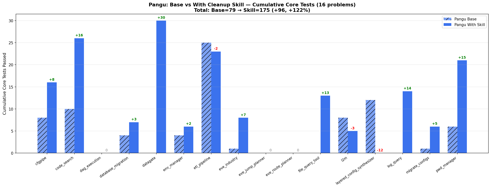
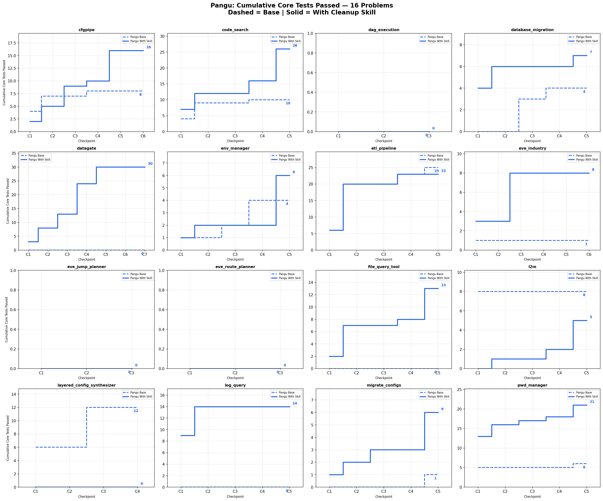
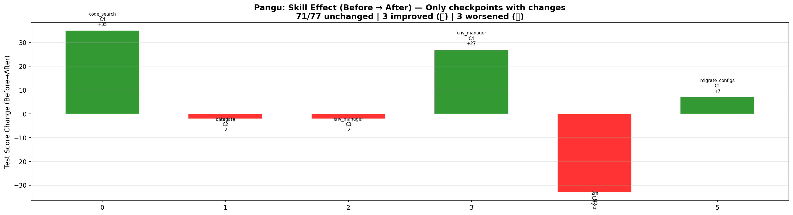

# Pangu: 16-Problem Summary — Base vs With Cleanup Skill

## Overview

16 problems, 77 checkpoints. Comparing Pangu Base (no skill) vs Pangu With Cleanup Skill (review-then-refactor).

## Charts

## Aggregate

| Metric | Value |
|--------|-------|
| Total cumulative core (Base) | 79 |
| Total cumulative core (Skill) | 175 |
| **Change** | **+96 (+122%)** |
| Problems improved | 11 |
| Problems worsened | 3 |
| Problems unchanged | 2 |

### Baseline vs Skill After (per checkpoint)

| | Count | % |
|---|---:|---:|
| 🟢 Skill After wins | 48 | 62% |
| 🔴 Baseline wins | 15 | 19% |
| ⚪ Tie | 14 | 18% |

### Before → After (true skill effect)

| | Count | % |
|---|---:|---:|
| 🟢 Same | 71 | 92% |
| 🟢 Improved | 3 | 4% |
| 🔴 Worsened | 3 | 4% |

**Improvements:**
- 🟢 code_search/C4: +35 tests (Core +4, Func +4, Regr +26, Error +1)
- 🟢 env_manager/C4: +27 tests (Regr +27)
- 🟢 migrate_configs/C1: +7 tests (Func +7)

**Regressions:**
- 🔴 l2m/C1: -33 tests (Core -7, Func -26)
- 🔴 datagate/C2: -2 tests (Error -2)
- 🔴 env_manager/C3: -2 tests (Func -1, Regr -1)

## Per-Problem Cumulative Core Tests

| Problem | Base | Skill | Δ | Base→After | Before→After |
|---------|------|-------|---|------------|--------------|
| cfgpipe | 8 | 16 | 🟢 +8 | Skill wins 5/6 | 6/6 = |
| code_search | 10 | 26 | 🟢 +16 | Skill wins 5/5 | 4/5 =, 1 🟢+35 |
| dag_execution | 0 | 0 | ⚪ 0 | Tie 1/1, Skill 0/1 | 1/1 = |
| database_migration | 4 | 7 | 🟢 +3 | Skill wins 4/5 | 5/5 = |
| datagate | 0 | 30 | 🟢 +30 | Skill wins 5/7, Tie 2 | 6/7 =, 1 🔴-2 |
| env_manager | 4 | 6 | 🟢 +2 | Skill 2, Base 3 | 3/5 =, 1 🟢+27, 1 🔴-2 |
| etl_pipeline | 25 | 23 | 🔴 -2 | Base 3, Skill 1, Tie 1 | 5/5 = |
| eve_industry | 1 | 8 | 🟢 +7 | Skill wins 4/6, Base 2 | 6/6 = |
| eve_jump_planner | 0 | 0 | ⚪ 0 | Tie 3/3 | 3/3 = |
| eve_route_planner | 0 | 0 | ⚪ 0 | Skill 1, Tie 2 | 3/3 = |
| file_query_tool | 0 | 13 | 🟢 +13 | Skill wins 5/5 | 5/5 = |
| l2m | 8 | 5 | 🔴 -3 | Skill 3, Base 1, Tie 1 | 4/5 =, 1 🔴-33 |
| layered_config_synthesizer | 12 | 0 | 🔴 -12 | Base wins 4/4 | 4/4 = |
| log_query | 0 | 14 | 🟢 +14 | Skill wins 5/5 | 5/5 = |
| migrate_configs | 1 | 6 | 🟢 +5 | Skill wins 5/5 | 4/5 =, 1 🟢+7 |
| pwd_manager | 6 | 21 | 🟢 +15 | Skill wins 5/5 | 5/5 = |

## Key Findings

1. **Skill run passes +122% more cumulative core tests than baseline**: Base 79 → Skill 175 (+96) across 16 problems
2. **11 out of 16 problems improved** with skill, 3 worsened, 2 unchanged
3. **Skill is safe (Before→After)**: 92% of checkpoints unchanged. 3 improved (+35, +27, +7 tests), 3 worsened (-33, -2, -2 tests)
4. **Biggest gains**: datagate +30, code_search +16, pwd_manager +15, log_query +14, file_query_tool +13
5. **Biggest losses**: layered_config_synthesizer -12, l2m -3, etl_pipeline -2
6. **l2m C1 regression is the most severe**: skill broke Core 7→0, Func 26→0 in one checkpoint (-33 tests)
