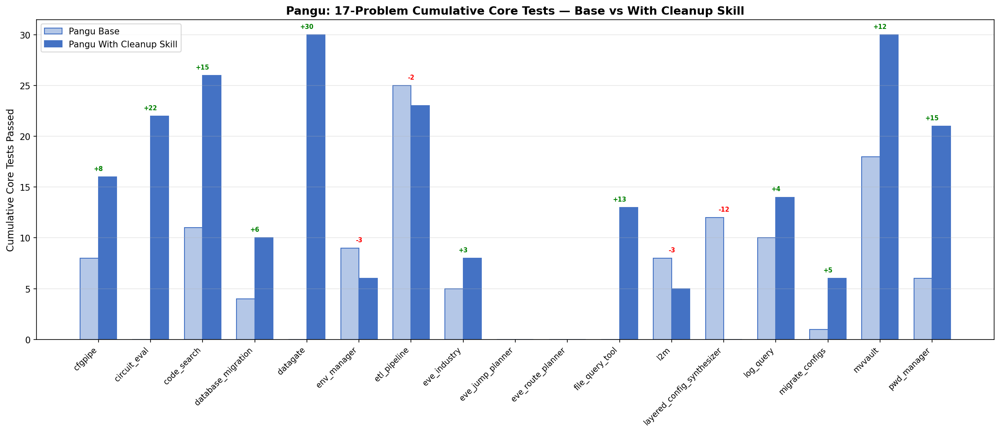
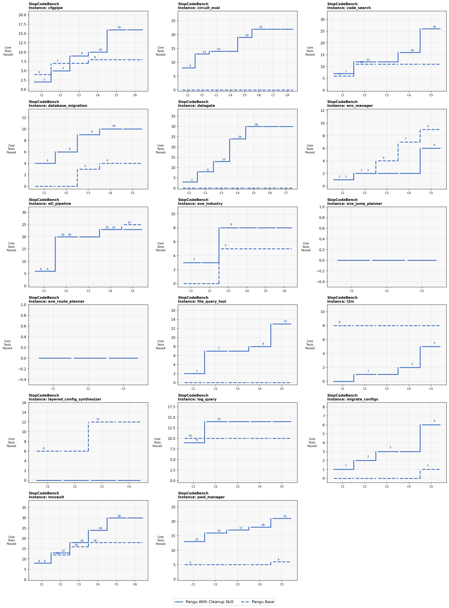
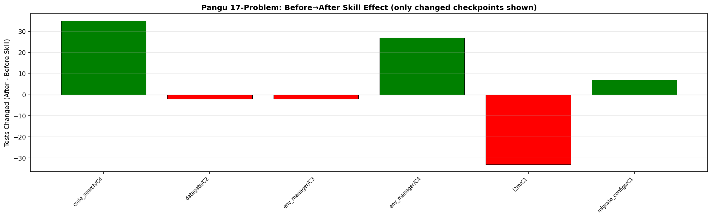

# Pangu: 17-Problem Summary — Base vs With Cleanup Skill

## Overview

17 problems, 88 checkpoints. Comparing Pangu Base (no skill) vs Pangu With Cleanup Skill (review-then-refactor).

## Charts







## Aggregate

| Metric | Value |
|--------|-------|
| Total cumulative core (Base) | 117 |
| Total cumulative core (Skill) | 230 |
| **Change** | **+113 (+97%)** |
| Problems improved | 11 |
| Problems worsened | 4 |
| Problems unchanged | 2 |

### Before → After (true skill effect)

| | Count | % |
|---|---:|---:|
| Same | 82 | 93% |
| 🟢 Improved | 3 | 3% |
| 🔴 Worsened | 3 | 3% |

**Improvements:**
- 🟢 code_search/C4: +35 tests (Core +4, Func +4, Regr +26, Error +1)
- 🟢 env_manager/C4: +27 tests (Regr +27)
- 🟢 migrate_configs/C1: +7 tests (Func +7)

**Regressions:**
- 🔴 l2m/C1: -33 tests (Core -7, Func -26)
- 🔴 datagate/C2: -2 tests (Error -2)
- 🔴 env_manager/C3: -2 tests (Func -1, Regr -1)

## Per-Problem Cumulative Core Tests

| Problem | Base | Skill | Δ |
|---------|------|-------|---|
| cfgpipe | 8 | 16 | 🟢 +8 |
| circuit_eval | 0 | 22 | 🟢 +22 |
| code_search | 11 | 26 | 🟢 +15 |
| database_migration | 4 | 10 | 🟢 +6 |
| datagate | 0 | 30 | 🟢 +30 |
| env_manager | 9 | 6 | 🔴 -3 |
| etl_pipeline | 25 | 23 | 🔴 -2 |
| eve_industry | 5 | 8 | 🟢 +3 |
| eve_jump_planner | 0 | 0 | ⚪ 0 |
| eve_route_planner | 0 | 0 | ⚪ 0 |
| file_query_tool | 0 | 13 | 🟢 +13 |
| l2m | 8 | 5 | 🔴 -3 |
| layered_config_synthesizer | 12 | 0 | 🔴 -12 |
| log_query | 10 | 14 | 🟢 +4 |
| migrate_configs | 1 | 6 | 🟢 +5 |
| mvvault | 18 | 30 | 🟢 +12 |
| pwd_manager | 6 | 21 | 🟢 +15 |

## Key Findings

1. **Skill run passes +97% more cumulative core tests than baseline**: Base 117 → Skill 230 (+113) across 17 problems
2. **11 out of 17 problems improved** with skill, 4 worsened, 2 unchanged
3. **Skill is safe (Before→After)**: 93% of checkpoints unchanged. 3 improved (+35, +27, +7 tests), 3 worsened (-33, -2, -2 tests)
4. **Biggest gains**: datagate +30, circuit_eval +22, code_search +15, pwd_manager +15, file_query_tool +13, mvvault +12
5. **Biggest losses**: layered_config_synthesizer -12, l2m -3, env_manager -3, etl_pipeline -2
6. **l2m C1 regression is the most severe**: skill broke Core 7→0, Func 26→0 in one checkpoint (-33 tests)

---

## Run Paths

```
cfgpipe:
  baseline: outputs/pangu/claude_code-2.0.51_baseline_20260603T1458/cfgpipe/
  review:   outputs/pangu/claude_code-2.0.51_review_refactor_20260602T0203/cfgpipe/

circuit_eval:
  baseline: outputs/pangu/claude_code-2.0.51_baseline_20260603T2011/circuit_eval/
  review:   outputs/pangu/claude_code-2.0.51_review_refactor_20260604T1409/circuit_eval/

code_search:
  baseline: outputs/pangu/claude_code-2.0.51_baseline_20260603T0121/code_search/
  review:   outputs/pangu/claude_code-2.0.51_review_refactor_20260602T0203/code_search/

database_migration:
  baseline: outputs/pangu/claude_code-2.0.51_baseline_20260604T1405/database_migration/
  review:   outputs/pangu/claude_code-2.0.51_review_refactor_20260603T2011/database_migration/

datagate:
  baseline: outputs/pangu/claude_code-2.0.51_baseline_20260603T2011/datagate/
  review:   outputs/pangu/claude_code-2.0.51_review_refactor_20260603T2011/datagate/

env_manager:
  baseline: outputs/pangu/claude_code-2.0.51_baseline_20260603T2011/env_manager/
  review:   outputs/pangu/claude_code-2.0.51_review_refactor_20260604T1409/env_manager/

etl_pipeline:
  baseline: outputs/pangu/claude_code-2.0.51_baseline_20260603T1458/etl_pipeline/
  review:   outputs/pangu/claude_code-2.0.51_review_refactor_20260602T0203/etl_pipeline/

eve_industry:
  baseline: outputs/pangu/claude_code-2.0.51_baseline_20260603T1458/eve_industry/
  review:   outputs/pangu/claude_code-2.0.51_review_refactor_20260602T0203/eve_industry/

eve_jump_planner:
  baseline: outputs/pangu/claude_code-2.0.51_baseline_20260603T1458/eve_jump_planner/
  review:   outputs/pangu/claude_code-2.0.51_review_refactor_20260602T0203/eve_jump_planner/

eve_route_planner:
  baseline: outputs/pangu/claude_code-2.0.51_baseline_20260604T1405/eve_route_planner/
  review:   outputs/pangu/claude_code-2.0.51_review_refactor_20260604T1409/eve_route_planner/

file_query_tool:
  baseline: outputs/pangu/claude_code-2.0.51_baseline_20260604T1405/file_query_tool/
  review:   outputs/pangu/claude_code-2.0.51_review_refactor_20260605T1442/file_query_tool/

l2m:
  baseline: outputs/pangu/claude_code-2.0.51_baseline_20260605T1442/l2m/
  review:   outputs/pangu/claude_code-2.0.51_review_refactor_20260605T1442/l2m/

layered_config_synthesizer:
  baseline: outputs/pangu/claude_code-2.0.51_baseline_20260604T1405/layered_config_synthesizer/
  review:   outputs/pangu/claude_code-2.0.51_review_refactor_20260605T1442/layered_config_synthesizer/

log_query:
  baseline: outputs/pangu/claude_code-2.0.51_baseline_20260604T1405/log_query/
  review:   outputs/pangu/claude_code-2.0.51_review_refactor_20260605T1442/log_query/

migrate_configs:
  baseline: outputs/pangu/claude_code-2.0.51_baseline_20260605T1442/migrate_configs/
  review:   outputs/pangu/claude_code-2.0.51_review_refactor_20260605T1442/migrate_configs/

mvvault:
  baseline: outputs/pangu/claude_code-2.0.51_baseline_20260605T1442/mvvault/
  review:   outputs/pangu/claude_code-2.0.51_review_refactor_20260605T1442/mvvault/

pwd_manager:
  baseline: outputs/pangu/claude_code-2.0.51_baseline_20260605T1442/pwd_manager/
  review:   outputs/pangu/claude_code-2.0.51_review_refactor_20260605T1442/pwd_manager/
```
