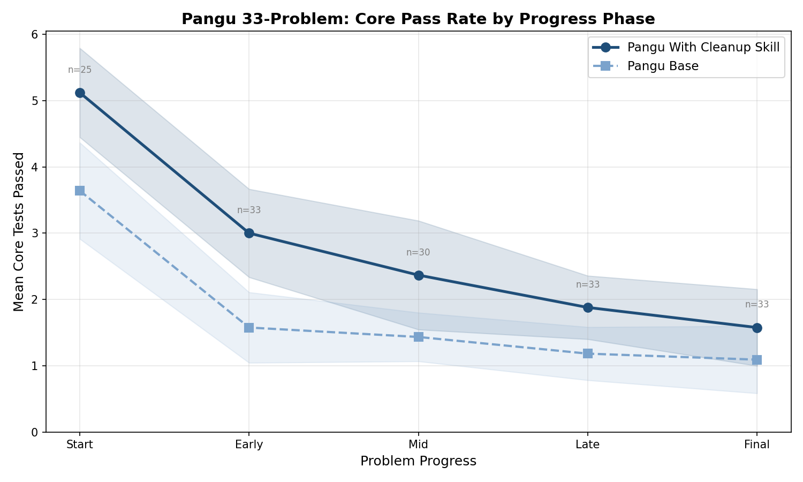
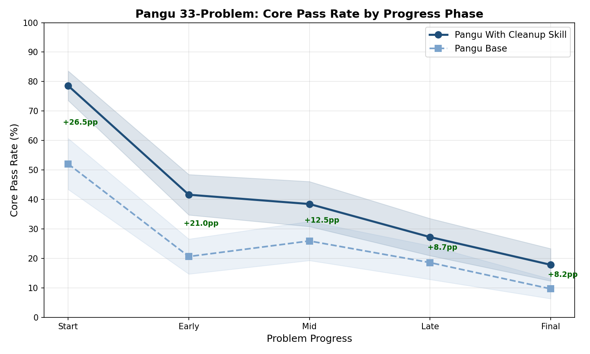
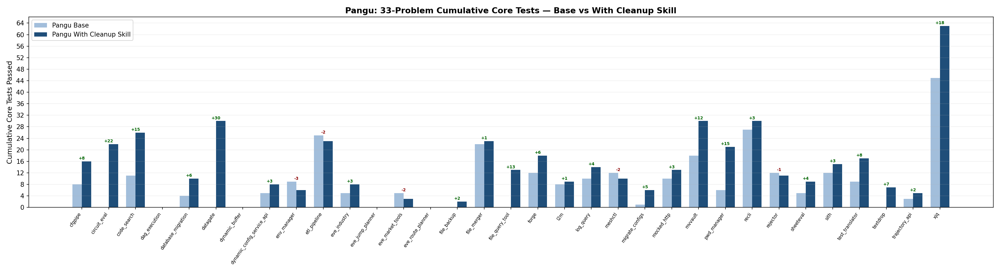
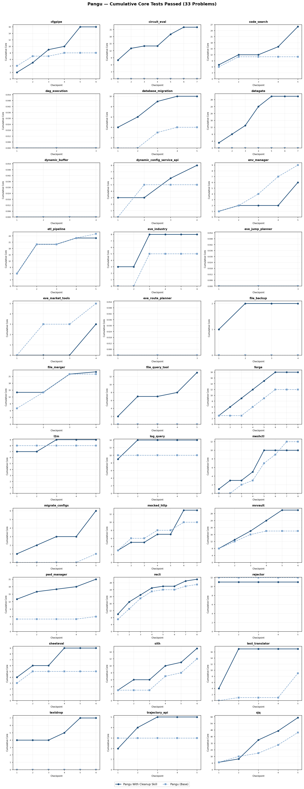
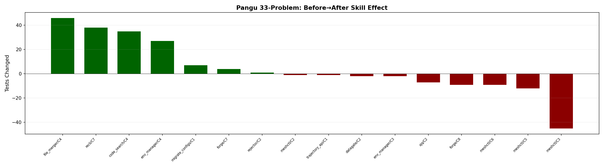

# Pangu: 33-Problem Summary — Base vs With Cleanup Skill

## Overview

33 problems, 175 checkpoints. Comparing Pangu Base (no skill) vs Pangu With Cleanup Skill (review-then-refactor).

## Key Findings

1. **Skill run passes +65% more cumulative core tests than baseline**: Base 284 → Skill 468 (+184) across 33 problems
2. **24 out of 33 problems improved** with skill, 5 worsened, 4 unchanged
3. **Skill is safe (Before→After)**: 90% of checkpoints unchanged. 7 improved, 9 worsened
4. **Biggest gains**: datagate +30, circuit_eval +22, xjq +18, code_search +15, pwd_manager +15, file_query_tool +13
5. **Biggest losses**: env_manager -3, etl_pipeline -2, eve_market_tools -2, meshctl -2, rejector -1
6. **Mean Δ/CP across 33 problems: +0.97** — on average, each checkpoint gains ~1 additional core test with the cleanup skill

## Core Pass Rate by Progress Phase





## Charts







## Aggregate

| Metric | Value |
|--------|-------|
| Total cumulative core (Base) | 284 |
| Total cumulative core (Skill) | 468 |
| **Change** | **+184 (+65%)** |
| Problems improved | 24 |
| Problems worsened | 5 |
| Problems unchanged | 4 |

### Before → After (true skill effect)

| | Count | % |
|---|---:|---:|
| Same | 151 | 90% |
| 🟢 Improved | 7 | 4% |
| 🔴 Worsened | 9 | 5% |

**Improvements:**
- 🟢 code_search/checkpoint_4: +35 tests (Regression +13, Regression +12, Regression +1, Core +4, Error +1, Functionality +4)
- 🟢 env_manager/checkpoint_4: +27 tests (Regression +7, Regression +19, Regression +1)
- 🟢 file_merger/checkpoint_4: +46 tests (Regression +29, Regression +9, Regression +7, Core +1)
- 🟢 forge/checkpoint_7: +4 tests (Regression +1, Regression +3)
- 🟢 migrate_configs/checkpoint_1: +7 tests (Functionality +7)
- 🟢 recli/checkpoint_7: +38 tests (Regression +3, Regression +4, Regression +3, Regression +3, Regression +10, Core +2, Error +1, Functionality +12)
- 🟢 rejector/checkpoint_2: +1 tests (Regression +1)

**Regressions:**
- 🔴 datagate/checkpoint_2: -2 tests (Error -2)
- 🔴 env_manager/checkpoint_3: -2 tests (Regression -1, Functionality -1)
- 🔴 forge/checkpoint_8: -9 tests (Error -6, Functionality -3)
- 🔴 meshctl/checkpoint_2: -1 tests (Core -1)
- 🔴 meshctl/checkpoint_3: -45 tests (Regression -21, Regression -13, Core -5, Functionality -6)
- 🔴 meshctl/checkpoint_5: -12 tests (Regression -10, Regression -2)
- 🔴 meshctl/checkpoint_6: -9 tests (Core -2, Error +1, Functionality -8)
- 🔴 trajectory_api/checkpoint_1: -1 tests (Core -1)
- 🔴 xjq/checkpoint_2: -7 tests (Core -3, Functionality -4)

## Per-Problem Cumulative Core Tests

| Problem | Base | Skill | Δ | CP | Δ/CP |
|---------|------|-------|---|-----|------|
| cfgpipe | 8 | 16 | 🟢 +8 | 6/6 | +1.33 |
| circuit_eval | 0 | 22 | 🟢 +22 | 7/8 | +3.14 |
| code_search | 11 | 26 | 🟢 +15 | 5/5 | +3.00 |
| dag_execution | 0 | 0 | ⚪ 0 | 3/3 | 0.00 |
| database_migration | 4 | 10 | 🟢 +6 | 5/5 | +1.20 |
| datagate | 0 | 30 | 🟢 +30 | 7/7 | +4.29 |
| dynamic_buffer | 0 | 0 | ⚪ 0 | 4/4 | 0.00 |
| dynamic_config_service_api | 5 | 8 | 🟢 +3 | 4/4 | +0.75 |
| env_manager | 9 | 6 | 🔴 -3 | 5/5 | -0.60 |
| etl_pipeline | 25 | 23 | 🔴 -2 | 5/5 | -0.40 |
| eve_industry | 5 | 8 | 🟢 +3 | 6/6 | +0.50 |
| eve_jump_planner | 0 | 0 | ⚪ 0 | 3/3 | 0.00 |
| eve_market_tools | 5 | 3 | 🔴 -2 | 4/4 | -0.50 |
| eve_route_planner | 0 | 0 | ⚪ 0 | 3/3 | 0.00 |
| file_backup | 0 | 2 | 🟢 +2 | 4/4 | +0.50 |
| file_merger | 22 | 23 | 🟢 +1 | 4/4 | +0.25 |
| file_query_tool | 0 | 13 | 🟢 +13 | 5/5 | +2.60 |
| forge | 12 | 18 | 🟢 +6 | 8/8 | +0.75 |
| l2m | 8 | 9 | 🟢 +1 | 5/5 | +0.20 |
| log_query | 10 | 14 | 🟢 +4 | 5/5 | +0.80 |
| meshctl | 12 | 10 | 🔴 -2 | 8/8 | -0.25 |
| migrate_configs | 1 | 6 | 🟢 +5 | 5/5 | +1.00 |
| mocked_http | 10 | 13 | 🟢 +3 | 7/8 | +0.43 |
| mvvault | 18 | 30 | 🟢 +12 | 6/6 | +2.00 |
| pwd_manager | 6 | 21 | 🟢 +15 | 5/5 | +3.00 |
| recli | 27 | 30 | 🟢 +3 | 8/8 | +0.38 |
| rejector | 12 | 11 | 🔴 -1 | 5/5 | -0.20 |
| sheeteval | 5 | 9 | 🟢 +4 | 6/7 | +0.67 |
| sith | 12 | 15 | 🟢 +3 | 6/6 | +0.50 |
| test_translator | 9 | 17 | 🟢 +8 | 5/6 | +1.60 |
| textdrop | 0 | 7 | 🟢 +7 | 6/6 | +1.17 |
| trajectory_api | 3 | 5 | 🟢 +2 | 5/5 | +0.40 |
| xjq | 45 | 63 | 🟢 +18 | 5/5 | +3.60 |

---

## Run Paths

```
cfgpipe:
  baseline: outputs/pangu/claude_code-2.0.51_baseline_20260603T1458/cfgpipe/
  review:   outputs/pangu/claude_code-2.0.51_review_refactor_20260602T0203/cfgpipe/

circuit_eval:
  baseline: outputs/pangu/claude_code-2.0.51_baseline_20260603T2011/circuit_eval/
  review:   outputs/pangu/claude_code-2.0.51_review_refactor_20260604T1409/circuit_eval/

code_search:
  baseline: outputs/pangu/claude_code-2.0.51_baseline_20260603T0121/code_search/
  review:   outputs/pangu/claude_code-2.0.51_review_refactor_20260602T0203/code_search/

dag_execution:
  baseline: outputs/pangu/claude_code-2.0.51_baseline_20260608T1608/dag_execution/
  review:   outputs/pangu/claude_code-2.0.51_review_refactor_20260602T0203/dag_execution/

database_migration:
  baseline: outputs/pangu/claude_code-2.0.51_baseline_20260604T1405/database_migration/
  review:   outputs/pangu/claude_code-2.0.51_review_refactor_20260603T2011/database_migration/

datagate:
  baseline: outputs/pangu/claude_code-2.0.51_baseline_20260603T2011/datagate/
  review:   outputs/pangu/claude_code-2.0.51_review_refactor_20260603T2011/datagate/

dynamic_buffer:
  baseline: outputs/pangu/claude_code-2.0.51_baseline_20260608T1608/dynamic_buffer/
  review:   outputs/pangu/claude_code-2.0.51_review_refactor_20260602T0203/dynamic_buffer/

dynamic_config_service_api:
  baseline: outputs/pangu/claude_code-2.0.51_baseline_20260608T1608/dynamic_config_service_api/
  review:   outputs/pangu/claude_code-2.0.51_review_refactor_20260608T1902/dynamic_config_service_api/

env_manager:
  baseline: outputs/pangu/claude_code-2.0.51_baseline_20260603T2011/env_manager/
  review:   outputs/pangu/claude_code-2.0.51_review_refactor_20260604T1409/env_manager/

etl_pipeline:
  baseline: outputs/pangu/claude_code-2.0.51_baseline_20260603T1458/etl_pipeline/
  review:   outputs/pangu/claude_code-2.0.51_review_refactor_20260602T0203/etl_pipeline/

eve_industry:
  baseline: outputs/pangu/claude_code-2.0.51_baseline_20260603T1458/eve_industry/
  review:   outputs/pangu/claude_code-2.0.51_review_refactor_20260602T0203/eve_industry/

eve_jump_planner:
  baseline: outputs/pangu/claude_code-2.0.51_baseline_20260603T1458/eve_jump_planner/
  review:   outputs/pangu/claude_code-2.0.51_review_refactor_20260602T0203/eve_jump_planner/

eve_market_tools:
  baseline: outputs/pangu/claude_code-2.0.51_baseline_20260604T1405/eve_market_tools/
  review:   outputs/pangu/claude_code-2.0.51_review_refactor_20260610T0303/eve_market_tools/

eve_route_planner:
  baseline: outputs/pangu/claude_code-2.0.51_baseline_20260604T1405/eve_route_planner/
  review:   outputs/pangu/claude_code-2.0.51_review_refactor_20260604T1409/eve_route_planner/

file_backup:
  baseline: outputs/pangu/claude_code-2.0.51_baseline_20260608T1608/file_backup/
  review:   outputs/pangu/claude_code-2.0.51_review_refactor_20260608T1615/file_backup/

file_merger:
  baseline: outputs/pangu/claude_code-2.0.51_baseline_20260608T1936/file_merger/
  review:   outputs/pangu/claude_code-2.0.51_review_refactor_20260608T1902/file_merger/

file_query_tool:
  baseline: outputs/pangu/claude_code-2.0.51_baseline_20260604T1405/file_query_tool/
  review:   outputs/pangu/claude_code-2.0.51_review_refactor_20260605T1442/file_query_tool/

forge:
  baseline: outputs/pangu/claude_code-2.0.51_baseline_20260604T1405/forge/
  review:   outputs/pangu/claude_code-2.0.51_review_refactor_20260610T0303/forge/

l2m:
  baseline: outputs/pangu/claude_code-2.0.51_baseline_20260605T1442/l2m/
  review:   outputs/pangu/claude_code-2.0.51_review_refactor_20260610T0303/l2m/

log_query:
  baseline: outputs/pangu/claude_code-2.0.51_baseline_20260604T1405/log_query/
  review:   outputs/pangu/claude_code-2.0.51_review_refactor_20260605T1442/log_query/

meshctl:
  baseline: outputs/pangu/claude_code-2.0.51_baseline_20260605T1442/meshctl/
  review:   outputs/pangu/claude_code-2.0.51_review_refactor_20260610T0303/meshctl/

migrate_configs:
  baseline: outputs/pangu/claude_code-2.0.51_baseline_20260605T1442/migrate_configs/
  review:   outputs/pangu/claude_code-2.0.51_review_refactor_20260605T1442/migrate_configs/

mocked_http:
  baseline: outputs/pangu/claude_code-2.0.51_baseline_20260608T2326/mocked_http/
  review:   outputs/pangu/claude_code-2.0.51_review_refactor_20260610T1405/mocked_http/

mvvault:
  baseline: outputs/pangu/claude_code-2.0.51_baseline_20260605T1442/mvvault/
  review:   outputs/pangu/claude_code-2.0.51_review_refactor_20260605T1442/mvvault/

pwd_manager:
  baseline: outputs/pangu/claude_code-2.0.51_baseline_20260605T1442/pwd_manager/
  review:   outputs/pangu/claude_code-2.0.51_review_refactor_20260605T1442/pwd_manager/

recli:
  baseline: outputs/pangu/claude_code-2.0.51_baseline_20260608T1608/recli/
  review:   outputs/pangu/claude_code-2.0.51_review_refactor_20260610T1405/recli/

rejector:
  baseline: outputs/pangu/claude_code-2.0.51_baseline_20260605T1442/rejector/
  review:   outputs/pangu/claude_code-2.0.51_review_refactor_20260608T1615/rejector/

sheeteval:
  baseline: outputs/pangu/claude_code-2.0.51_baseline_20260608T1608/sheeteval/
  review:   outputs/pangu/claude_code-2.0.51_review_refactor_20260610T1527/sheeteval/

sith:
  baseline: outputs/pangu/claude_code-2.0.51_baseline_20260605T1442/sith/
  review:   outputs/pangu/claude_code-2.0.51_review_refactor_20260611T0157/sith/

test_translator:
  baseline: outputs/pangu/claude_code-2.0.51_baseline_20260608T2326/test_translator/
  review:   outputs/pangu/claude_code-2.0.51_review_refactor_20260610T1527/test_translator/

textdrop:
  baseline: outputs/pangu/claude_code-2.0.51_baseline_20260608T1608/textdrop/
  review:   outputs/pangu/claude_code-2.0.51_review_refactor_20260610T0303/textdrop/

trajectory_api:
  baseline: outputs/pangu/claude_code-2.0.51_baseline_20260605T1442/trajectory_api/
  review:   outputs/pangu/claude_code-2.0.51_review_refactor_20260610T1405/trajectory_api/

xjq:
  baseline: outputs/pangu/claude_code-2.0.51_baseline_20260605T1442/xjq/
  review:   outputs/pangu/claude_code-2.0.51_review_refactor_20260610T0303/xjq/

```
