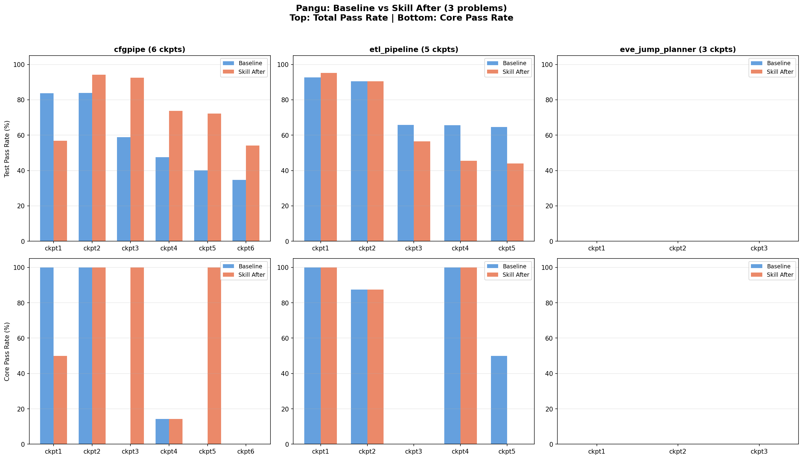

# Pangu: Baseline vs Skill (cfgpipe, etl_pipeline, eve_jump_planner)

## Run Info

| Field | Value |
|-------|-------|
| **Model** | Pangu (via `127.0.0.1:8088` / ModelArts) |
| **Agent** | Claude Code 2.0.51 |
| **Skill** | Review-Then-Refactor (3-phase: Audit → Safety Check → Apply) |
| **Baseline run** | `outputs/pangu/claude_code-2.0.51_just-solve_none_20260603T1458` |
| **Skill run** | `outputs/pangu/claude_code-2.0.51_review_refactor_20260602T0203` |

## cfgpipe (6 checkpoints)

| Ckpt | | Core | Func | Regr | Err | Code Δ | Baseline→After | Before→After |
|------|---|------|------|------|-----|--------|----------------|--------------|
| 1 | Baseline | 4/4 ✅ | 18/20 | - | 9/13 | | | |
| | Before | 2/4 ❌ | 14/20 | - | 5/13 | | | |
| | After | 2/4 ❌ | 14/20 | - | 5/13 | +0/−7 | 🔴 Core -2, Func -4, Err -4 | 🟢 = |
| 2 | Baseline | 3/3 ✅ | 15/15 | 31/37 | 8/13 | | | |
| | Before | 3/3 ✅ | 15/15 | 34/37 | 12/13 | | | |
| | After | 3/3 ✅ | 15/15 | 34/37 | 12/13 | +0/−1 | 🟢 Regr +3, Err +4 | 🟢 = |
| 3 | Baseline | 0/4 ❌ | 2/13 | 57/68 | 4/22 | | | |
| | Before | 4/4 ✅ | 10/13 | 64/68 | 21/22 | | | |
| | After | 4/4 ✅ | 10/13 | 64/68 | 21/22 | +6/−9 | 🟢 Core +4, Func +8, Regr +7, Err +17 | 🟢 = |
| 4 | Baseline | 1/7 ❌ | 1/17 | 63/107 | 0/6 | | | |
| | Before | 1/7 ❌ | 1/17 | 99/107 | 0/6 | | | |
| | After | 1/7 ❌ | 1/17 | 99/107 | 0/6 | unchanged | 🟢 Regr +36 | 🟢 = |
| 5 | Baseline | 0/6 ❌ | 1/34 | 65/137 | 9/10 | | | |
| | Before | 6/6 ✅ | 24/34 | 96/137 | 9/10 | | | |
| | After | 6/6 ✅ | 24/34 | 96/137 | 9/10 | +4/−47 | 🟢 Core +6, Func +23, Regr +31 | 🟢 = |
| 6 | Baseline | 0/3 ❌ | 0/21 | 75/187 | 0/5 | | | |
| | Before | 0/3 ❌ | 2/21 | 112/187 | 3/5 | | | |
| | After | 0/3 ❌ | 2/21 | 112/187 | 3/5 | +2/−6 | 🟢 Func +2, Regr +37, Err +3 | 🟢 = |

## etl_pipeline (5 checkpoints)

| Ckpt | | Core | Func | Regr | Err | Code Δ | Baseline→After | Before→After |
|------|---|------|------|------|-----|--------|----------------|--------------|
| 1 | Baseline | 6/6 ✅ | 13/13 | - | 19/22 | | | |
| | Before | 6/6 ✅ | 13/13 | - | 20/22 | | | |
| | After | 6/6 ✅ | 13/13 | - | 20/22 | +0/−6 | 🟢 Err +1 | 🟢 = |
| 2 | Baseline | 14/16 ❌ | 9/11 | 38/41 | 5/5 | | | |
| | Before | 14/16 ❌ | 10/11 | 38/41 | 4/5 | | | |
| | After | 14/16 ❌ | 10/11 | 38/41 | 4/5 | unchanged | 🟢 Func +1, 🔴 Err -1 | 🟢 = |
| 3 | Baseline | 0/4 ❌ | 4/31 | 66/73 | 7/9 | | | |
| | Before | 0/4 ❌ | 0/31 | 66/73 | 0/9 | | | |
| | After | 0/4 ❌ | 0/31 | 66/73 | 0/9 | +1/−8 | 🔴 Func -4, 🔴 Err -7 | 🟢 = |
| 4 | Baseline | 3/3 ✅ | 5/7 | 77/117 | 3/7 | | | |
| | Before | 3/3 ✅ | 5/7 | 47/117 | 6/7 | | | |
| | After | 3/3 ✅ | 5/7 | 47/117 | 6/7 | unchanged | 🔴 Regr -30, 🟢 Err +3 | 🟢 = |
| 5 | Baseline | 2/4 ❌ | 11/18 | 87/134 | 6/8 | | | |
| | Before | 0/4 ❌ | 6/18 | 62/134 | 4/8 | | | |
| | After | 0/4 ❌ | 6/18 | 62/134 | 4/8 | unchanged | 🔴 Core -2, Func -5, Regr -25, Err -2 | 🟢 = |

## eve_jump_planner (3 checkpoints)

| Ckpt | | Core | Func | Regr | Err | Code Δ | Baseline→After | Before→After |
|------|---|------|------|------|-----|--------|----------------|--------------|
| 1 | Baseline | 0/2 ❌ | 0/9 | - | - | | | |
| | Before | 0/2 ❌ | 0/9 | - | - | | | |
| | After | 0/2 ❌ | 0/9 | - | - | +0/−20 | 🟢 = | 🟢 = |
| 2 | Baseline | 0/1 ❌ | 0/7 | 0/11 | - | | | |
| | Before | 0/1 ❌ | 0/7 | 0/11 | - | | | |
| | After | 0/1 ❌ | 0/7 | 0/11 | - | +2/−7 | 🟢 = | 🟢 = |
| 3 | Baseline | 0/1 ❌ | 0/11 | 0/19 | - | | | |
| | Before | 0/1 ❌ | 0/11 | 0/19 | - | | | |
| | After | 0/1 ❌ | 0/11 | 0/19 | - | unchanged | 🟢 = | 🟢 = |

## Code Health Analysis

Health scored 1-10 (10 = perfect) using repo-analysis. Main solution file per problem.

### cfgpipe (cfgpipe.py)

| Ckpt | Baseline Health | Before Health | After Health | Baseline→After | Before→After |
|------|----------------|---------------|-------------|----------------|--------------|
| 1 | 5.0 | 5.0 | 5.0 | ⚪ = | ⚪ = |
| 2 | 4.48 | 4.82 | 4.82 | 🟢 +0.34 | ⚪ = |
| 3 | 4.48 | 5.0 | 5.0 | 🟢 +0.52 | ⚪ = |
| 4 | 3.0 | 5.0 | 5.0 | 🟢 +2.0 | ⚪ = |
| 5 | 3.0 | 4.0 | 4.0 | 🟢 +1.0 | ⚪ = |
| 6 | 3.0 | 4.0 | 4.0 | 🟢 +1.0 | ⚪ = |

**Skill After has better health in ckpt2-6.** But this is model non-determinism — the skill run wrote structurally cleaner code (fewer complex conditionals). Skill itself (Before→After) has zero health impact.

### etl_pipeline (etl_pipeline.py)

| Ckpt | Baseline Health | Before Health | After Health | Baseline→After | Before→After |
|------|----------------|---------------|-------------|----------------|--------------|
| 1 | 5.0 | 3.0 | 3.0 | 🔴 -2.0 | ⚪ = |
| 2 | 4.0 | 3.0 | 3.0 | 🔴 -1.0 | ⚪ = |
| 3 | 4.0 | 3.0 | 3.0 | 🔴 -1.0 | ⚪ = |
| 4 | 3.0 | 3.0 | 3.0 | ⚪ = | ⚪ = |
| 5 | 3.0 | 3.0 | 3.0 | ⚪ = | ⚪ = |

**Baseline has better health in ckpt1-3.** But baseline ckpt1 health=5.0 with test pass=92%, while Skill After health=3.0 with test pass=95% — more complex code that works better.

### eve_jump_planner (did_he_say_jump.py)

| Ckpt | Baseline Health | Before Health | After Health | Baseline→After | Before→After |
|------|----------------|---------------|-------------|----------------|--------------|
| 1 | 3.0 | 3.0 | 3.0 | ⚪ = | ⚪ = |
| 2 | 3.0 | 2.0 | 2.0 | 🔴 -1.0 | ⚪ = |
| 3 | 3.0 | 2.0 | 2.0 | 🔴 -1.0 | ⚪ = |

Both runs produce low-health code with 0% test pass. Neither can solve this problem.

### Health vs Performance Tradeoff (all 3 problems)

| Problem | Better Health | Better Test Performance |
|---------|--------------|----------------------|
| cfgpipe | 🟢 Skill After (ckpt2-6) | 🟢 Skill After (ckpt2-5) |
| etl_pipeline | 🟢 Baseline (ckpt1-3) | Mixed (Baseline ckpt3,5 / Skill ckpt1,2) |
| eve_jump_planner | 🟢 Baseline (ckpt2-3) | Tie (both 0%) |

**cfgpipe: Skill After wins both health AND performance** — rare case where the model happened to write cleaner AND more correct code.
**etl_pipeline: Classic tradeoff** — Baseline has cleaner code but mixed test results.
**eve_jump_planner: Neither wins** — problem too hard for Pangu.

### Skill Effect on Health (Before → After)

**All 14 checkpoints: Before = After.** Zero health change from the review-then-refactor skill across all problems.

## Summary

### Skill Effect (Before → After)

| | 🟢 Improved | 🟢 Same | 🔴 Worsened |
|---|------------|---------|------------|
| All 14 checkpoints | 0 | **14** | **0** |

**Review-then-refactor: zero regressions, zero improvements across all 14 checkpoints.** Code was modified in 10/14 checkpoints but all changes were behavior-preserving.

### Baseline → Skill After (model non-determinism)

| Problem | Baseline wins | Skill After wins | Tie |
|---------|--------------|-----------------|-----|
| cfgpipe | 1 (ckpt1) | 4 (ckpt2,3,4,5) | 1 (ckpt6 mixed) |
| etl_pipeline | 2 (ckpt3,5) | 2 (ckpt1,2) | 1 (ckpt4 mixed) |
| eve_jump_planner | 0 | 0 | 3 |

**cfgpipe:** Skill After much stronger — ckpt3 Core 0→4, ckpt5 Core 0→6  
**etl_pipeline:** Mixed — Baseline better on later checkpoints  
**eve_jump_planner:** Both 0% — neither run could solve this problem

Note: Baseline→After differences are from model non-determinism (two independent runs), not the skill.
