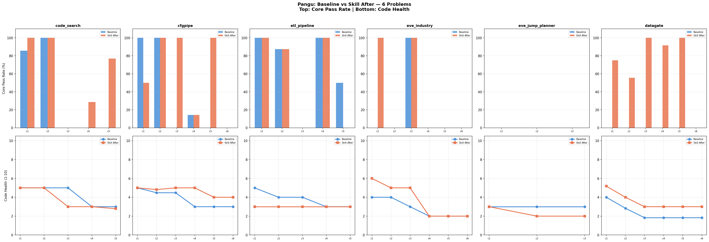

# Pangu: Baseline vs Skill — 6 Problems Comparison

## Run Info

| Field | Value |
|-------|-------|
| **Model** | Pangu |
| **Agent** | Claude Code 2.0.51 |
| **Skill** | Review-Then-Refactor (3-phase: Audit → Safety Check → Apply) |
| **Baseline run** | `pangu/.../20260603T1458` (cfgpipe, etl_pipeline, eve_jump_planner) + `pangu/.../20260603T0121` (code_search) |
| **Skill run** | `pangu/...review_refactor_20260602T0203` |

---

## code_search (5 checkpoints)

### Test Results

| Ckpt | | Core | Func | Regr | Err | Code Δ | Baseline→After | Before→After |
|------|---|------|------|------|-----|--------|----------------|--------------|
| 1 | Baseline | 6/7 ❌ | 3/4 | - | 2/2 | | | |
| | Before | 7/7 ✅ | 4/4 | - | 2/2 | | | |
| | After | 7/7 ✅ | 4/4 | - | 2/2 | +10/−13 | 🟢 Core +1, Func +1 | 🟢 = |
| 2 | Baseline | 5/5 ✅ | 5/5 | 11/13 | 2/2 | | | |
| | Before | 5/5 ✅ | 5/5 | 13/13 | 2/2 | | | |
| | After | 5/5 ✅ | 5/5 | 13/13 | 2/2 | +0/−2 | 🟢 Regr +2 | 🟢 = |
| 3 | Baseline | 0/8 ❌ | 0/12 | 0/25 | 0/2 | | | |
| | Before | 0/8 ❌ | 0/12 | 25/25 | 1/2 | | | |
| | After | 0/8 ❌ | 0/12 | 25/25 | 1/2 | +5/−5 | 🟢 Regr +25, Err +1 | 🟢 = |
| 4 | Baseline | 0/14 ❌ | 0/12 | 0/47 | 1/2 | | | |
| | Before | 0/14 ❌ | 0/12 | 0/47 | 1/2 | | | |
| | After | 4/14 ❌ | 4/12 | 26/47 | 2/2 | +11/−7 | 🟢 Core +4, Func +4, Regr +26, Err +1 | 🟢 Core +4, Func +4, Regr +26, Err +1 |
| 5 | Baseline | 0/13 ❌ | 0/14 | 4/75 | 1/2 | | | |
| | Before | 10/13 ❌ | 5/14 | 36/75 | 2/2 | | | |
| | After | 10/13 ❌ | 5/14 | 36/75 | 2/2 | +2/−3 | 🟢 Core +10, Func +5, Regr +32, Err +1 | 🟢 = |

### Code Health (code_search.py)

| Ckpt | Baseline | Before | After | Baseline→After | Before→After |
|------|----------|--------|-------|----------------|--------------|
| 1 | 5.0 (nest=5, cc=4) | 5.0 (nest=4, cc=4) | 5.0 (nest=4, cc=4) | 🟢 nest -1 | ⚪ = |
| 2 | 5.0 (nest=5, cc=5) | 5.0 (nest=4, cc=4) | 5.0 (nest=4, cc=4) | 🟢 nest -1, cc -1 | ⚪ = |
| 3 | 5.0 (nest=5, cc=7) | 3.0 (nest=10, cc=92) | 3.0 (nest=10, cc=92) | 🔴 health -2.0 | ⚪ = |
| 4 | 3.0 (nest=9, cc=17) | 3.0 (nest=10, cc=99) | 3.0 (nest=10, cc=99) | ⚪ = | ⚪ = |
| 5 | 3.0 (nest=9, cc=17) | 2.79 (nest=10, cc=181) | 2.79 (nest=10, cc=181) | 🔴 health -0.21 | ⚪ = |

---

## cfgpipe (6 checkpoints)

### Test Results

| Ckpt | | Core | Func | Regr | Err | Code Δ | Baseline→After | Before→After |
|------|---|------|------|------|-----|--------|----------------|--------------|
| 1 | Baseline | 4/4 ✅ | 18/20 | - | 9/13 | | | |
| | Before | 2/4 ❌ | 14/20 | - | 5/13 | | | |
| | After | 2/4 ❌ | 14/20 | - | 5/13 | +0/−7 | 🔴 Core -2, Func -4, Err -4 | 🟢 = |
| 2 | Baseline | 3/3 ✅ | 15/15 | 31/37 | 8/13 | | | |
| | Before | 3/3 ✅ | 15/15 | 34/37 | 12/13 | | | |
| | After | 3/3 ✅ | 15/15 | 34/37 | 12/13 | +0/−1 | 🟢 Regr +3, Err +4 | 🟢 = |
| 3 | Baseline | 0/4 ❌ | 2/13 | 57/68 | 4/22 | | | |
| | Before | 4/4 ✅ | 10/13 | 64/68 | 21/22 | | | |
| | After | 4/4 ✅ | 10/13 | 64/68 | 21/22 | +6/−9 | 🟢 Core +4, Func +8, Regr +7, Err +17 | 🟢 = |
| 4 | Baseline | 1/7 ❌ | 1/17 | 63/107 | 0/6 | | | |
| | Before | 1/7 ❌ | 1/17 | 99/107 | 0/6 | | | |
| | After | 1/7 ❌ | 1/17 | 99/107 | 0/6 | unchanged | 🟢 Regr +36 | 🟢 = |
| 5 | Baseline | 0/6 ❌ | 1/34 | 65/137 | 9/10 | | | |
| | Before | 6/6 ✅ | 24/34 | 96/137 | 9/10 | | | |
| | After | 6/6 ✅ | 24/34 | 96/137 | 9/10 | +4/−47 | 🟢 Core +6, Func +23, Regr +31 | 🟢 = |
| 6 | Baseline | 0/3 ❌ | 0/21 | 75/187 | 0/5 | | | |
| | Before | 0/3 ❌ | 2/21 | 112/187 | 3/5 | | | |
| | After | 0/3 ❌ | 2/21 | 112/187 | 3/5 | +2/−6 | 🟢 Func +2, Regr +37, Err +3 | 🟢 = |

### Code Health (cfgpipe.py)

| Ckpt | Baseline | Before | After | Baseline→After | Before→After |
|------|----------|--------|-------|----------------|--------------|
| 1 | 5.0 (nest=5, cc=4) | 5.0 (nest=5, cc=4) | 5.0 (nest=5, cc=4) | ⚪ = | ⚪ = |
| 2 | 4.48 (nest=5, cc=6) | 4.82 (nest=5, cc=5) | 4.82 (nest=5, cc=5) | 🟢 +0.34 | ⚪ = |
| 3 | 4.48 (nest=5, cc=6) | 5.0 (nest=5, cc=8) | 5.0 (nest=5, cc=8) | 🟢 +0.52 | ⚪ = |
| 4 | 3.0 (nest=7, cc=15) | 5.0 (nest=5, cc=8) | 5.0 (nest=5, cc=8) | 🟢 +2.0 | ⚪ = |
| 5 | 3.0 (nest=10, cc=17) | 4.0 (nest=10, cc=8) | 4.0 (nest=10, cc=8) | 🟢 +1.0 | ⚪ = |
| 6 | 3.0 (nest=10, cc=22) | 4.0 (nest=11, cc=12) | 4.0 (nest=11, cc=12) | 🟢 +1.0 | ⚪ = |

---

## etl_pipeline (5 checkpoints)

### Test Results

| Ckpt | | Core | Func | Regr | Err | Code Δ | Baseline→After | Before→After |
|------|---|------|------|------|-----|--------|----------------|--------------|
| 1 | Baseline | 6/6 ✅ | 13/13 | - | 19/22 | | | |
| | Before | 6/6 ✅ | 13/13 | - | 20/22 | | | |
| | After | 6/6 ✅ | 13/13 | - | 20/22 | +0/−6 | 🟢 Err +1 | 🟢 = |
| 2 | Baseline | 14/16 ❌ | 9/11 | 38/41 | 5/5 | | | |
| | Before | 14/16 ❌ | 10/11 | 38/41 | 4/5 | | | |
| | After | 14/16 ❌ | 10/11 | 38/41 | 4/5 | unchanged | 🟢 Func +1, 🔴 Err -1 | 🟢 = |
| 3 | Baseline | 0/4 ❌ | 4/31 | 66/73 | 7/9 | | | |
| | Before | 0/4 ❌ | 0/31 | 66/73 | 0/9 | | | |
| | After | 0/4 ❌ | 0/31 | 66/73 | 0/9 | +1/−8 | 🔴 Func -4, Err -7 | 🟢 = |
| 4 | Baseline | 3/3 ✅ | 5/7 | 77/117 | 3/7 | | | |
| | Before | 3/3 ✅ | 5/7 | 47/117 | 6/7 | | | |
| | After | 3/3 ✅ | 5/7 | 47/117 | 6/7 | unchanged | 🔴 Regr -30, 🟢 Err +3 | 🟢 = |
| 5 | Baseline | 2/4 ❌ | 11/18 | 87/134 | 6/8 | | | |
| | Before | 0/4 ❌ | 6/18 | 62/134 | 4/8 | | | |
| | After | 0/4 ❌ | 6/18 | 62/134 | 4/8 | unchanged | 🔴 Core -2, Func -5, Regr -25, Err -2 | 🟢 = |

### Code Health (etl_pipeline.py)

| Ckpt | Baseline | Before | After | Baseline→After | Before→After |
|------|----------|--------|-------|----------------|--------------|
| 1 | 5.0 (nest=3, cc=5) | 3.0 (nest=7, cc=16) | 3.0 (nest=7, cc=16) | 🔴 -2.0 | ⚪ = |
| 2 | 4.0 (nest=12, cc=22) | 3.0 (nest=8, cc=34) | 3.0 (nest=8, cc=34) | 🔴 -1.0 | ⚪ = |
| 3 | 4.0 (nest=12, cc=23) | 3.0 (nest=8, cc=34) | 3.0 (nest=8, cc=34) | 🔴 -1.0 | ⚪ = |
| 4 | 3.0 (nest=12, cc=25) | 3.0 (nest=12, cc=44) | 3.0 (nest=12, cc=44) | ⚪ = | ⚪ = |
| 5 | 3.0 (nest=12, cc=30) | 3.0 (nest=12, cc=52) | 3.0 (nest=12, cc=52) | ⚪ = | ⚪ = |

---

## eve_jump_planner (3 checkpoints)

### Test Results

| Ckpt | | Core | Func | Regr | Err | Code Δ | Baseline→After | Before→After |
|------|---|------|------|------|-----|--------|----------------|--------------|
| 1 | Baseline | 0/2 ❌ | 0/9 | - | - | | | |
| | Before | 0/2 ❌ | 0/9 | - | - | | | |
| | After | 0/2 ❌ | 0/9 | - | - | +0/−20 | 🟢 = | 🟢 = |
| 2 | Baseline | 0/1 ❌ | 0/7 | 0/11 | - | | | |
| | Before | 0/1 ❌ | 0/7 | 0/11 | - | | | |
| | After | 0/1 ❌ | 0/7 | 0/11 | - | +2/−7 | 🟢 = | 🟢 = |
| 3 | Baseline | 0/1 ❌ | 0/11 | 0/19 | - | | | |
| | Before | 0/1 ❌ | 0/11 | 0/19 | - | | | |
| | After | 0/1 ❌ | 0/11 | 0/19 | - | unchanged | 🟢 = | 🟢 = |

### Code Health (did_he_say_jump.py)

| Ckpt | Baseline | Before | After | Baseline→After | Before→After |
|------|----------|--------|-------|----------------|--------------|
| 1 | 3.0 (nest=6, cc=6) | 3.0 (nest=6, cc=5) | 3.0 (nest=6, cc=5) | ⚪ = | ⚪ = |
| 2 | 3.0 (nest=6, cc=6) | 2.0 (nest=6, cc=8) | 2.0 (nest=6, cc=8) | 🔴 -1.0 | ⚪ = |
| 3 | 3.0 (nest=6, cc=7) | 2.0 (nest=6, cc=13) | 2.0 (nest=6, cc=13) | 🔴 -1.0 | ⚪ = |

---

## eve_industry (6 checkpoints)

### Test Results

| Ckpt | | Core | Func | Regr | Err | Code Δ | Baseline→After | Before→After |
|------|---|------|------|------|-----|--------|----------------|--------------|
| 1 | Baseline | 0/3 ❌ | 0/6 | - | 3/3 | | | |
| | Before | 3/3 ✅ | 6/6 | - | 3/3 | | | |
| | After | 3/3 ✅ | 6/6 | - | 3/3 | +1/−2 | 🟢 Core +3, Func +6 | 🟢 = |
| 2 | Baseline | 0/7 ❌ | 0/11 | 3/12 | 3/3 | | | |
| | Before | 0/7 ❌ | 0/11 | 12/12 | 3/3 | | | |
| | After | 0/7 ❌ | 0/11 | 12/12 | 3/3 | +0/−67 | 🟢 Regr +9 | 🟢 = |
| 3 | Baseline | 5/5 ✅ | 3/7 | 13/33 | 5/5 | | | |
| | Before | 5/5 ✅ | 6/7 | 15/33 | 5/5 | | | |
| | After | 5/5 ✅ | 6/7 | 15/33 | 5/5 | +1/−42 | 🟢 Func +3, Regr +2 | 🟢 = |
| 4 | Baseline | 0/2 ❌ | 1/5 | 26/50 | 2/2 | | | |
| | Before | 0/2 ❌ | 0/5 | 31/50 | 2/2 | | | |
| | After | 0/2 ❌ | 0/5 | 31/50 | 2/2 | unchanged | 🟢 Regr +5, 🔴 Func -1 | 🟢 = |
| 5 | Baseline | 0/3 ❌ | 1/8 | 29/59 | 3/3 | | | |
| | Before | 0/3 ❌ | 0/8 | 13/59 | 3/3 | | | |
| | After | 0/3 ❌ | 0/8 | 13/59 | 3/3 | +11/−22 | 🔴 Func -1, Regr -16 | 🟢 = |
| 6 | Baseline | 0/2 ❌ | 0/3 | 32/73 | 2/2 | | | |
| | Before | 0/2 ❌ | 0/3 | 16/73 | 2/2 | | | |
| | After | 0/2 ❌ | 0/3 | 16/73 | 2/2 | +3/−6 | 🔴 Regr -16 | 🟢 = |

### Code Health (industry.py)

| Ckpt | Baseline | Before | After | Baseline→After | Before→After |
|------|----------|--------|-------|----------------|--------------|
| 1 | 4.0 | 6.0 | 6.0 | 🟢 +2.0 | ⚪ = |
| 2 | 4.0 | 5.0 | 5.0 | 🟢 +1.0 | ⚪ = |
| 3 | 3.0 | 5.0 | 5.0 | 🟢 +2.0 | ⚪ = |
| 4 | 2.0 | 2.0 | 2.0 | ⚪ = | ⚪ = |
| 5 | 2.0 | 2.0 | 2.0 | ⚪ = | ⚪ = |
| 6 | 2.0 | 2.0 | 2.0 | ⚪ = | ⚪ = |

---

## Aggregate Summary

### Skill Effect (Before → After) — all 25 checkpoints

| | 🟢 Improved | 🟢 Same | 🔴 Worsened |
|---|------------|---------|------------|
| Test scores | **1** (code_search ckpt4) | **24** | **0** |
| Code health | **0** | **25** | **0** |

**Review-then-refactor: zero regressions across 25 checkpoints.** One bug fix (code_search ckpt4, +35 tests from 18-line edit). Code health unchanged in all cases.

### Baseline → Skill After — Performance

| Problem | Skill After wins | Baseline wins | Tie |
|---------|-----------------|--------------|-----|
| code_search | 4 ckpts | 0 | 1 |
| cfgpipe | 4 ckpts | 1 | 1 |
| etl_pipeline | 2 ckpts | 2 | 1 |
| eve_industry | 3 ckpts | 2 | 1 |
| eve_jump_planner | 0 | 0 | 3 |
| **Total** | **13** | **5** | **7** |

### Baseline → Skill After — Code Health

| Problem | Skill After better | Baseline better | Tie |
|---------|-------------------|----------------|-----|
| code_search | 2 ckpts (ckpt1-2) | 2 ckpts (ckpt3,5) | 1 |
| cfgpipe | 5 ckpts (ckpt2-6) | 0 | 1 |
| etl_pipeline | 0 | 3 ckpts (ckpt1-3) | 2 |
| eve_industry | 3 ckpts (ckpt1-3) | 0 | 3 |
| eve_jump_planner | 0 | 2 ckpts (ckpt2-3) | 1 |
| **Total** | **10** | **7** | **8** |

Note: Baseline→After differences are from model non-determinism (two independent runs), not the skill.

### Key Takeaways

1. **Skill is safe**: 0/25 regressions, 0/25 health degradation (Before→After)
2. **Skill can fix bugs**: code_search ckpt4 gained 35 tests from a small edit
3. **Performance: Skill After wins 13 vs Baseline 5** — but this is model randomness
4. **Health: Skill After 10 vs Baseline 7** — slight advantage for skill run
5. **cfgpipe stands out**: Skill After wins both health AND performance (ckpt3 Core 0→4, ckpt5 Core 0→6, health +2.0)
6. **eve_industry**: Skill After has better health (ckpt1-3) AND performance (ckpt1 Core 0→3)
7. **eve_jump_planner**: too hard for Pangu — both 0% across all checkpoints
