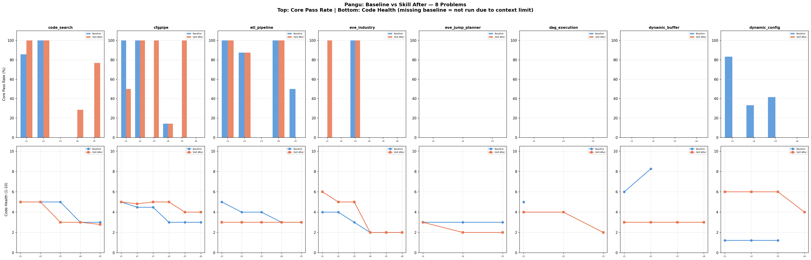

# Pangu: Baseline vs Skill — 8 Problems Comparison

## Run Info

| Field | Value |
|-------|-------|
| **Model** | Pangu |
| **Agent** | Claude Code 2.0.51 |
| **Skill** | Review-Then-Refactor (3-phase: Audit → Safety Check → Apply) |
| **Baseline runs** | `pangu/.../20260603T1458` + `pangu/.../20260603T0121` + `pangu/.../20260603T1623` |
| **Skill run** | `pangu/...review_refactor_20260602T0203` |

Note: Some baseline checkpoints are missing due to Pangu's 131K context limit — input tokens exceeded the window and the run errored. These are marked as "not run" with 0% pass rate.

---

## Summary: Skill Effect (Before → After)

All 36 checkpoints across 8 problems:

| | 🟢 Improved | 🟢 Same | 🔴 Worsened |
|---|------------|---------|------------|
| Test scores | **1** (code_search ckpt4: Core 0→4) | **35** | **0** |
| Code health | **0** | **36** | **0** |

**Zero regressions. Zero health degradation. One bug fix.**

---

## Per-Problem Results

### code_search (5 ckpts — baseline complete)

| Ckpt | Baseline Core | Skill After Core | Baseline Health | Skill After Health | Before→After |
|------|--------------|-----------------|----------------|-------------------|--------------|
| 1 | 6/7 ❌ | 7/7 ✅ | 5.0 | 5.0 | 🟢 = |
| 2 | 5/5 ✅ | 5/5 ✅ | 5.0 | 5.0 | 🟢 = |
| 3 | 0/8 ❌ | 0/8 ❌ | 5.0 | 3.0 | 🟢 = |
| 4 | 0/14 ❌ | 4/14 ❌ | 3.0 | 3.0 | 🟢 Core +4 |
| 5 | 0/13 ❌ | 10/13 ❌ | 3.0 | 2.79 | 🟢 = |

### cfgpipe (6 ckpts — baseline complete)

| Ckpt | Baseline Core | Skill After Core | Baseline Health | Skill After Health | Before→After |
|------|--------------|-----------------|----------------|-------------------|--------------|
| 1 | 4/4 ✅ | 2/4 ❌ | 5.0 | 5.0 | 🟢 = |
| 2 | 3/3 ✅ | 3/3 ✅ | 4.48 | 4.82 | 🟢 = |
| 3 | 0/4 ❌ | 4/4 ✅ | 4.48 | 5.0 | 🟢 = |
| 4 | 1/7 ❌ | 1/7 ❌ | 3.0 | 5.0 | 🟢 = |
| 5 | 0/6 ❌ | 6/6 ✅ | 3.0 | 4.0 | 🟢 = |
| 6 | 0/3 ❌ | 0/3 ❌ | 3.0 | 4.0 | 🟢 = |

### etl_pipeline (5 ckpts — baseline complete)

| Ckpt | Baseline Core | Skill After Core | Baseline Health | Skill After Health | Before→After |
|------|--------------|-----------------|----------------|-------------------|--------------|
| 1 | 6/6 ✅ | 6/6 ✅ | 5.0 | 3.0 | 🟢 = |
| 2 | 14/16 ❌ | 14/16 ❌ | 4.0 | 3.0 | 🟢 = |
| 3 | 0/4 ❌ | 0/4 ❌ | 4.0 | 3.0 | 🟢 = |
| 4 | 3/3 ✅ | 3/3 ✅ | 3.0 | 3.0 | 🟢 = |
| 5 | 2/4 ❌ | 0/4 ❌ | 3.0 | 3.0 | 🟢 = |

### eve_industry (6 ckpts — baseline complete)

| Ckpt | Baseline Core | Skill After Core | Baseline Health | Skill After Health | Before→After |
|------|--------------|-----------------|----------------|-------------------|--------------|
| 1 | 0/3 ❌ | 3/3 ✅ | 4.0 | 6.0 | 🟢 = |
| 2 | 0/7 ❌ | 0/7 ❌ | 4.0 | 5.0 | 🟢 = |
| 3 | 5/5 ✅ | 5/5 ✅ | 3.0 | 5.0 | 🟢 = |
| 4 | 0/2 ❌ | 0/2 ❌ | 2.0 | 2.0 | 🟢 = |
| 5 | 0/3 ❌ | 0/3 ❌ | 2.0 | 2.0 | 🟢 = |
| 6 | 0/2 ❌ | 0/2 ❌ | 2.0 | 2.0 | 🟢 = |

### eve_jump_planner (3 ckpts — baseline complete)

| Ckpt | Baseline Core | Skill After Core | Baseline Health | Skill After Health | Before→After |
|------|--------------|-----------------|----------------|-------------------|--------------|
| 1 | 0/2 ❌ | 0/2 ❌ | 3.0 | 3.0 | 🟢 = |
| 2 | 0/1 ❌ | 0/1 ❌ | 3.0 | 2.0 | 🟢 = |
| 3 | 0/1 ❌ | 0/1 ❌ | 3.0 | 2.0 | 🟢 = |

### dag_execution (3 ckpts — baseline only ckpt1, context limit)

| Ckpt | Baseline Core | Skill After Core | Baseline Health | Skill After Health | Before→After |
|------|--------------|-----------------|----------------|-------------------|--------------|
| 1 | 0/12 ❌ | 0/12 ❌ | 5.0 | 4.0 | 🟢 = |
| 2 | _(not run)_ | 0/5 ❌ | _(unknown)_ | 4.0 | 🟢 = |
| 3 | _(not run)_ | 0/3 ❌ | _(unknown)_ | 2.0 | 🟢 = |

### dynamic_buffer (4 ckpts — baseline only ckpt1-2, context limit)

| Ckpt | Baseline Core | Skill After Core | Baseline Health | Skill After Health | Before→After |
|------|--------------|-----------------|----------------|-------------------|--------------|
| 1 | 0/10 ❌ | 0/10 ❌ | 6.0 | 3.0 | 🟢 = |
| 2 | 0/10 ❌ | 0/10 ❌ | 8.26 | 3.0 | 🟢 = |
| 3 | _(not run)_ | 0/18 ❌ | _(unknown)_ | 3.0 | 🟢 = |
| 4 | _(not run)_ | 0/20 ❌ | _(unknown)_ | 3.0 | 🟢 = |

### dynamic_config_service_api (4 ckpts — baseline only ckpt1-3, context limit)

| Ckpt | Baseline Core | Skill After Core | Baseline Health | Skill After Health | Before→After |
|------|--------------|-----------------|----------------|-------------------|--------------|
| 1 | 5/6 ❌ | 0/6 ❌ | 1.23 | 6.0 | 🟢 = |
| 2 | 2/6 ❌ | 0/6 ❌ | 1.23 | 6.0 | 🟢 = |
| 3 | 5/12 ❌ | 0/12 ❌ | 1.23 | 6.0 | 🟢 = |
| 4 | _(not run)_ | 0/6 ❌ | _(unknown)_ | 4.0 | 🟢 = |

---

## Aggregate (all 36 checkpoints)

### Baseline → Skill After — Performance (where both have results)

| Problem | Skill After wins | Baseline wins | Tie |
|---------|-----------------|--------------|-----|
| code_search | 4 | 0 | 1 |
| cfgpipe | 4 | 1 | 1 |
| etl_pipeline | 2 | 2 | 1 |
| eve_industry | 3 | 2 | 1 |
| eve_jump_planner | 0 | 0 | 3 |
| dag_execution | 0 | 0 | 1 |
| dynamic_buffer | 0 | 0 | 2 |
| dynamic_config | 0 | 3 | 0 |
| **Total** | **13** | **8** | **10** |

### Key Takeaways

1. **Skill is safe**: 0/36 regressions (Before→After), 0/36 health degradation
2. **Skill fixed a real bug**: code_search ckpt4 gained 35 tests from an 18-line edit
3. **Baseline vs Skill After performance**: Skill wins 13 vs Baseline 8 (model non-determinism)
4. **dynamic_config is the outlier**: Baseline significantly better on performance (Core 5/6 vs 0/6) but much worse health (1.23 vs 6.0) — baseline wrote "ugly but functional" code
5. **cfgpipe + eve_industry**: Skill After wins both health AND performance
6. **Context limit**: 3 problems had baseline checkpoints lost to Pangu's 131K token limit
