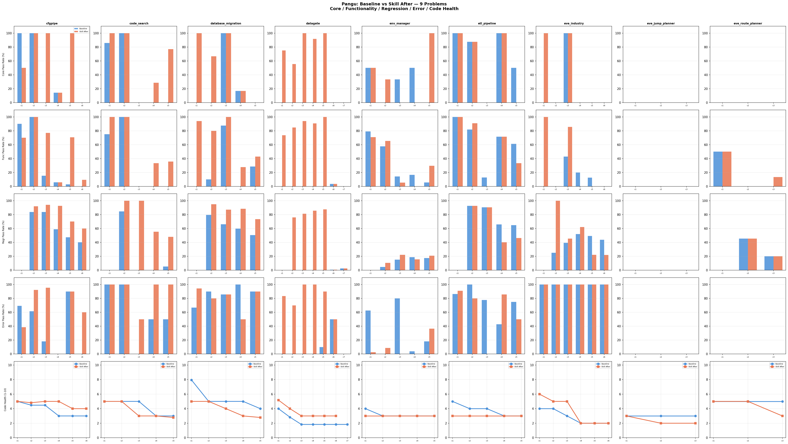

# Pangu: 9-Problem Full Comparison — Baseline vs Skill After

## Run Sources

| Problem | Skill Run | Baseline Run | Note |
|---------|-----------|-------------|------|
| cfgpipe | review_refactor_20260602T0203 | baseline_20260603T1458 | |
| code_search | review_refactor_20260602T0203 | baseline_20260603T0121 | baseline error but all ckpts done |
| database_migration | review_refactor_20260603T2011 | baseline_20260604T1405 | last ckpt skill incomplete |
| datagate | review_refactor_20260603T2011 | baseline_20260603T2011 | last ckpt skill incomplete |
| env_manager | review_refactor_20260604T1409 | baseline_20260604T1405 | |
| etl_pipeline | review_refactor_20260602T0203 | baseline_20260603T1458 | |
| eve_industry | review_refactor_20260602T0203 | baseline_20260603T1458 | baseline error but all ckpts done |
| eve_jump_planner | review_refactor_20260602T0203 | baseline_20260603T1458 | |
| eve_route_planner | review_refactor_20260604T1409 | baseline_20260604T1405 | |

## Aggregate (45 checkpoints, 9 problems)

### Skill Effect: Before → After

| | Count | % |
|---|---:|---:|
| 🟢 Same | 41 | 91% |
| 🟢 Improved | 2 | 4% |
| 🔴 Worsened | 2 | 4% |

### Baseline → Skill After

| | Count | % |
|---|---:|---:|
| 🟢 Skill After wins | 28 | 62% |
| 🔴 Baseline wins | 10 | 22% |
| ⚪ Tie | 7 | 16% |

Note: Baseline→After reflects model non-determinism, not skill effect.

---

## Per-Problem Detail

### cfgpipe (6 checkpoints)

| Ckpt | | Core | Func | Regr | Err | Base→After | Before→After |
|------|---|------|------|------|-----|------------|--------------|
| 1 | Baseline | 4/4 ✅ | 18/20 | - | 9/13 | | |
| 1 | After | 2/4 ❌ | 14/20 | - | 5/13 | 🔴C-2, 🔴F-4, 🔴E-4 | 🟢 = |
| 2 | Baseline | 3/3 ✅ | 15/15 | 31/37 | 8/13 | | |
| 2 | After | 3/3 ✅ | 15/15 | 34/37 | 12/13 | 🟢R+3, 🟢E+4 | 🟢 = |
| 3 | Baseline | 0/4 ❌ | 2/13 | 57/68 | 4/22 | | |
| 3 | After | 4/4 ✅ | 10/13 | 64/68 | 21/22 | 🟢C+4, 🟢F+8, 🟢R+7, 🟢E+17 | 🟢 = |
| 4 | Baseline | 1/7 ❌ | 1/17 | 63/107 | 0/6 | | |
| 4 | After | 1/7 ❌ | 1/17 | 99/107 | 0/6 | 🟢R+36 | 🟢 = |
| 5 | Baseline | 0/6 ❌ | 1/34 | 65/137 | 9/10 | | |
| 5 | After | 6/6 ✅ | 24/34 | 96/137 | 9/10 | 🟢C+6, 🟢F+23, 🟢R+31 | 🟢 = |
| 6 | Baseline | 0/3 ❌ | 0/21 | 75/187 | 0/5 | | |
| 6 | After | 0/3 ❌ | 2/21 | 112/187 | 3/5 | 🟢F+2, 🟢R+37, 🟢E+3 | 🟢 = |

### code_search (5 checkpoints)

| Ckpt | | Core | Func | Regr | Err | Base→After | Before→After |
|------|---|------|------|------|-----|------------|--------------|
| 1 | Baseline | 6/7 ❌ | 3/4 | - | 2/2 | | |
| 1 | After | 7/7 ✅ | 4/4 | - | 2/2 | 🟢C+1, 🟢F+1 | 🟢 = |
| 2 | Baseline | 5/5 ✅ | 5/5 | 11/13 | 2/2 | | |
| 2 | After | 5/5 ✅ | 5/5 | 13/13 | 2/2 | 🟢R+2 | 🟢 = |
| 3 | Baseline | 0/8 ❌ | 0/12 | 0/25 | 0/2 | | |
| 3 | After | 0/8 ❌ | 0/12 | 25/25 | 1/2 | 🟢R+25, 🟢E+1 | 🟢 = |
| 4 | Baseline | 0/14 ❌ | 0/12 | 0/47 | 1/2 | | |
| 4 | After | 4/14 ❌ | 4/12 | 26/47 | 2/2 | 🟢C+4, 🟢F+4, 🟢R+26, 🟢E+1 | 🟢C+4, 🟢F+4, 🟢R+26, 🟢E+1 |
| 5 | Baseline | 0/13 ❌ | 0/14 | 4/75 | 1/2 | | |
| 5 | After | 10/13 ❌ | 5/14 | 36/75 | 2/2 | 🟢C+10, 🟢F+5, 🟢R+32, 🟢E+1 | 🟢 = |

### database_migration (5 checkpoints, last ckpt skill incomplete)

| Ckpt | | Core | Func | Regr | Err | Base→After | Before→After |
|------|---|------|------|------|-----|------------|--------------|
| 1 | Baseline | 0/4 ❌ | 0/17 | - | 12/18 | | |
| 1 | After | 4/4 ✅ | 16/17 | - | 17/18 | 🟢C+4, 🟢F+16, 🟢E+5 | 🟢 = |
| 2 | Baseline | 0/3 ❌ | 1/10 | 31/39 | 9/10 | | |
| 2 | After | 2/3 ❌ | 8/10 | 37/39 | 8/10 | 🟢C+2, 🟢F+7, 🟢R+6, 🔴E-1 | 🟢 = |
| 3 | Baseline | 3/3 ✅ | 7/8 | 41/62 | 12/14 | | |
| 3 | After | 3/3 ✅ | 8/8 | 54/62 | 12/14 | 🟢F+1, 🟢R+13 | 🟢 = |
| 4 | Baseline | 1/6 ❌ | 0/18 | 52/87 | 6/6 | | |
| 4 | After | 1/6 ❌ | 5/18 | 77/87 | 3/6 | 🟢F+5, 🟢R+25, 🔴E-3 | 🟢 = |
| 5 | Baseline | 0/3 ❌ | 2/7 | 59/117 | 9/10 | | |
| 5 | After | 0/3 ❌ | 3/7 | 86/117 | 9/10 | 🟢F+1, 🟢R+27 | 🟢 = |

### datagate (7 checkpoints, last ckpt skill incomplete)

| Ckpt | | Core | Func | Regr | Err | Base→After | Before→After |
|------|---|------|------|------|-----|------------|--------------|
| 1 | Baseline | 0/4 ❌ | 0/34 | - | 0/12 | | |
| 1 | After | 3/4 ❌ | 25/34 | - | 10/12 | 🟢C+3, 🟢F+25, 🟢E+10 | 🟢 = |
| 2 | Baseline | 0/9 ❌ | 0/33 | 0/50 | 0/30 | | |
| 2 | After | 5/9 ❌ | 28/33 | 38/50 | 21/30 | 🟢C+5, 🟢F+28, 🟢R+38, 🟢E+21 | 🔴E-2 |
| 3 | Baseline | 0/5 ❌ | 0/34 | 0/122 | 0/13 | | |
| 3 | After | 5/5 ✅ | 32/34 | 99/122 | 13/13 | 🟢C+5, 🟢F+32, 🟢R+99, 🟢E+13 | 🟢 = |
| 4 | Baseline | 0/12 ❌ | 0/32 | 0/174 | 0/15 | | |
| 4 | After | 11/12 ❌ | 29/32 | 149/174 | 15/15 | 🟢C+11, 🟢F+29, 🟢R+149, 🟢E+15 | 🟢 = |
| 5 | Baseline | 0/6 ❌ | 0/17 | 0/233 | 2/20 | | |
| 5 | After | 6/6 ✅ | 17/17 | 204/233 | 18/20 | 🟢C+6, 🟢F+17, 🟢R+204, 🟢E+16 | 🟢 = |
| 6 | Baseline | 0/12 ❌ | 2/55 | 2/276 | 5/10 | | |
| 6 | After | 0/12 ❌ | 2/55 | 2/276 | 5/10 | = | 🟢 = |

### env_manager (5 checkpoints)

| Ckpt | | Core | Func | Regr | Err | Base→After | Before→After |
|------|---|------|------|------|-----|------------|--------------|
| 1 | Baseline | 1/2 ❌ | 19/24 | - | 25/40 | | |
| 1 | After | 1/2 ❌ | 17/24 | - | 1/40 | 🔴F-2, 🔴E-24 | 🟢 = |
| 2 | Baseline | 0/3 ❌ | 15/26 | 3/66 | 0/23 | | |
| 2 | After | 1/3 ❌ | 17/26 | 7/66 | 2/23 | 🟢C+1, 🟢F+2, 🟢R+4, 🟢E+2 | 🟢 = |
| 3 | Baseline | 1/3 ❌ | 8/56 | 18/118 | 8/10 | | |
| 3 | After | 0/3 ❌ | 3/56 | 26/118 | 0/10 | 🔴C-1, 🔴F-5, 🟢R+8, 🔴E-8 | 🔴F-1, 🔴R-1 |
| 4 | Baseline | 2/4 ❌ | 3/18 | 35/187 | 1/26 | | |
| 4 | After | 0/4 ❌ | 0/18 | 29/187 | 0/26 | 🔴C-2, 🔴F-3, 🔴R-6, 🔴E-1 | 🟢R+27 |
| 5 | Baseline | 0/4 ❌ | 3/54 | 41/235 | 2/11 | | |
| 5 | After | 4/4 ✅ | 16/54 | 49/235 | 4/11 | 🟢C+4, 🟢F+13, 🟢R+8, 🟢E+2 | 🟢 = |

### etl_pipeline (5 checkpoints)

| Ckpt | | Core | Func | Regr | Err | Base→After | Before→After |
|------|---|------|------|------|-----|------------|--------------|
| 1 | Baseline | 6/6 ✅ | 13/13 | - | 19/22 | | |
| 1 | After | 6/6 ✅ | 13/13 | - | 20/22 | 🟢E+1 | 🟢 = |
| 2 | Baseline | 14/16 ❌ | 9/11 | 38/41 | 5/5 | | |
| 2 | After | 14/16 ❌ | 10/11 | 38/41 | 4/5 | 🟢F+1, 🔴E-1 | 🟢 = |
| 3 | Baseline | 0/4 ❌ | 4/31 | 66/73 | 7/9 | | |
| 3 | After | 0/4 ❌ | 0/31 | 66/73 | 0/9 | 🔴F-4, 🔴E-7 | 🟢 = |
| 4 | Baseline | 3/3 ✅ | 5/7 | 77/117 | 3/7 | | |
| 4 | After | 3/3 ✅ | 5/7 | 47/117 | 6/7 | 🔴R-30, 🟢E+3 | 🟢 = |
| 5 | Baseline | 2/4 ❌ | 11/18 | 87/134 | 6/8 | | |
| 5 | After | 0/4 ❌ | 6/18 | 62/134 | 4/8 | 🔴C-2, 🔴F-5, 🔴R-25, 🔴E-2 | 🟢 = |

### eve_industry (6 checkpoints)

| Ckpt | | Core | Func | Regr | Err | Base→After | Before→After |
|------|---|------|------|------|-----|------------|--------------|
| 1 | Baseline | 0/3 ❌ | 0/6 | - | 3/3 | | |
| 1 | After | 3/3 ✅ | 6/6 | - | 3/3 | 🟢C+3, 🟢F+6 | 🟢 = |
| 2 | Baseline | 0/7 ❌ | 0/11 | 3/12 | 3/3 | | |
| 2 | After | 0/7 ❌ | 0/11 | 12/12 | 3/3 | 🟢R+9 | 🟢 = |
| 3 | Baseline | 5/5 ✅ | 3/7 | 13/33 | 5/5 | | |
| 3 | After | 5/5 ✅ | 6/7 | 15/33 | 5/5 | 🟢F+3, 🟢R+2 | 🟢 = |
| 4 | Baseline | 0/2 ❌ | 1/5 | 26/50 | 2/2 | | |
| 4 | After | 0/2 ❌ | 0/5 | 31/50 | 2/2 | 🔴F-1, 🟢R+5 | 🟢 = |
| 5 | Baseline | 0/3 ❌ | 1/8 | 29/59 | 3/3 | | |
| 5 | After | 0/3 ❌ | 0/8 | 13/59 | 3/3 | 🔴F-1, 🔴R-16 | 🟢 = |
| 6 | Baseline | 0/2 ❌ | 0/3 | 32/73 | 2/2 | | |
| 6 | After | 0/2 ❌ | 0/3 | 16/73 | 2/2 | 🔴R-16 | 🟢 = |

### eve_jump_planner (3 checkpoints)

| Ckpt | | Core | Func | Regr | Err | Base→After | Before→After |
|------|---|------|------|------|-----|------------|--------------|
| 1 | Baseline | 0/2 ❌ | 0/9 | - | - | | |
| 1 | After | 0/2 ❌ | 0/9 | - | - | = | 🟢 = |
| 2 | Baseline | 0/1 ❌ | 0/7 | 0/11 | - | | |
| 2 | After | 0/1 ❌ | 0/7 | 0/11 | - | = | 🟢 = |
| 3 | Baseline | 0/1 ❌ | 0/11 | 0/19 | - | | |
| 3 | After | 0/1 ❌ | 0/11 | 0/19 | - | = | 🟢 = |

### eve_route_planner (3 checkpoints)

| Ckpt | | Core | Func | Regr | Err | Base→After | Before→After |
|------|---|------|------|------|-----|------------|--------------|
| 1 | Baseline | 0/1 ❌ | 5/10 | - | - | | |
| 1 | After | 0/1 ❌ | 5/10 | - | - | = | 🟢 = |
| 2 | Baseline | 0/2 ❌ | 0/12 | 5/11 | - | | |
| 2 | After | 0/2 ❌ | 0/12 | 5/11 | - | = | 🟢 = |
| 3 | Baseline | 0/1 ❌ | 0/15 | 5/25 | - | | |
| 3 | After | 0/1 ❌ | 2/15 | 5/25 | - | 🟢F+2 | 🟢 = |

---

## Key Findings

1. **Skill is safe**: 41/45 checkpoints (91%) Before=After, zero score change
2. **Skill improvements**: code_search ckpt4 (+35 tests from bug fix), env_manager ckpt4 (+27 regression tests)
3. **Skill regressions**: datagate ckpt2 (-2 error tests), env_manager ckpt3 (-1 func, -1 regr) — minor
4. **Baseline→After**: Skill After wins 28 vs Baseline 10 — but this is model non-determinism, not skill effect
5. **datagate**: Baseline all 0% (code broken), Skill After up to Core 11/12 — largest gap from model randomness
6. **etl_pipeline ckpt5**: Baseline better (Core 2/4 vs 0/4) — skill run wrote worse code for this checkpoint
7. **eve_jump_planner**: Both 0% — too hard for Pangu
