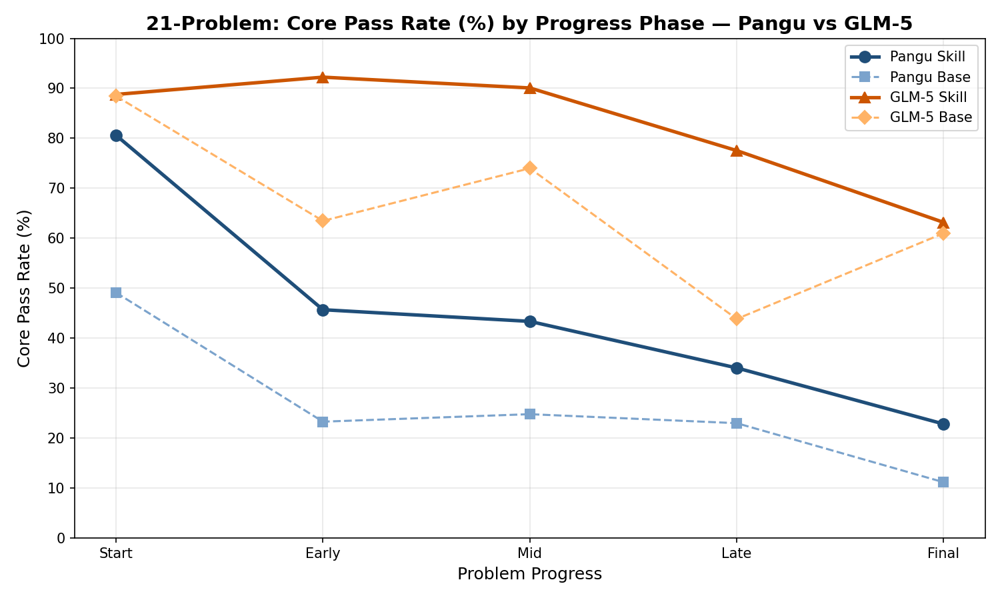
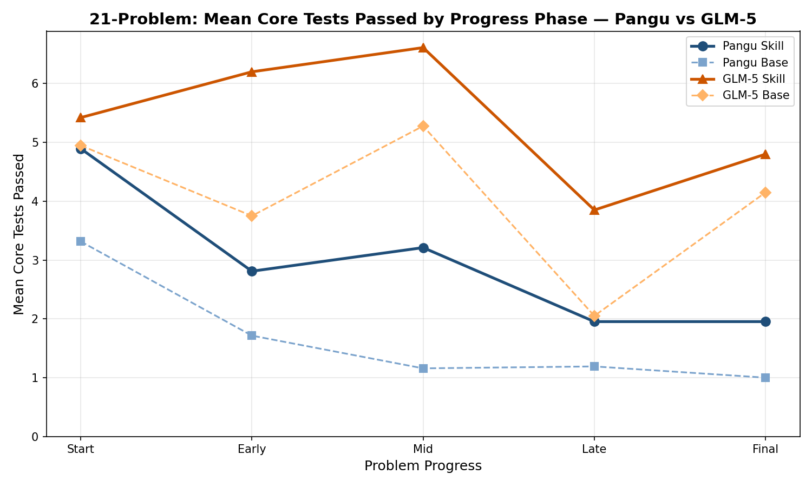
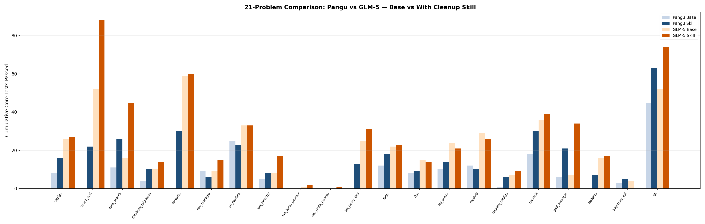

# Combined: 21-Problem Summary — Pangu vs GLM-5, Base vs With Cleanup Skill

## Overview

21 problems compared across both models.

## Key Findings

| Metric | Pangu | GLM-5 |
|--------|-------|-------|
| Base Core Total | 177 | 451 |
| Skill Core Total | 337 | 590 |
| **Change** | **+160 (+90%)** | **+139 (+31%)** |
| Problems improved | 16 | 16 |
| Problems worsened | 3 | 4 |
| Problems unchanged | 2 | 1 |

## Core Pass Rate by Progress Phase

## Charts

## Per-Problem Cumulative Core Tests

| Problem | Pangu Base | Pangu Skill | Pangu Δ | GLM Base | GLM Skill | GLM Δ |
|---------|-----------|-------------|---------|---------|-----------|-------|
| cfgpipe | 8 | 16 | 🟢 +8 | 26 | 27 | 🟢 +1 |
| circuit_eval | 0 | 22 | 🟢 +22 | 52 | 88 | 🟢 +36 |
| code_search | 11 | 26 | 🟢 +15 | 16 | 45 | 🟢 +29 |
| database_migration | 4 | 10 | 🟢 +6 | 10 | 14 | 🟢 +4 |
| datagate | 0 | 30 | 🟢 +30 | 59 | 60 | 🟢 +1 |
| env_manager | 9 | 6 | 🔴 -3 | 9 | 15 | 🟢 +6 |
| etl_pipeline | 25 | 23 | 🔴 -2 | 33 | 33 | ⚪ 0 |
| eve_industry | 5 | 8 | 🟢 +3 | 8 | 17 | 🟢 +9 |
| eve_jump_planner | 0 | 0 | ⚪ 0 | 1 | 2 | 🟢 +1 |
| eve_route_planner | 0 | 0 | ⚪ 0 | 0 | 1 | 🟢 +1 |
| file_query_tool | 0 | 13 | 🟢 +13 | 25 | 31 | 🟢 +6 |
| forge | 12 | 18 | 🟢 +6 | 22 | 23 | 🟢 +1 |
| l2m | 8 | 9 | 🟢 +1 | 15 | 14 | 🔴 -1 |
| log_query | 10 | 14 | 🟢 +4 | 24 | 21 | 🔴 -3 |
| meshctl | 12 | 10 | 🔴 -2 | 29 | 26 | 🔴 -3 |
| migrate_configs | 1 | 6 | 🟢 +5 | 7 | 9 | 🟢 +2 |
| mvvault | 18 | 30 | 🟢 +12 | 36 | 39 | 🟢 +3 |
| pwd_manager | 6 | 21 | 🟢 +15 | 7 | 34 | 🟢 +27 |
| textdrop | 0 | 7 | 🟢 +7 | 16 | 17 | 🟢 +1 |
| trajectory_api | 3 | 5 | 🟢 +2 | 4 | 0 | 🔴 -4 |
| xjq | 45 | 63 | 🟢 +18 | 52 | 74 | 🟢 +22 |

