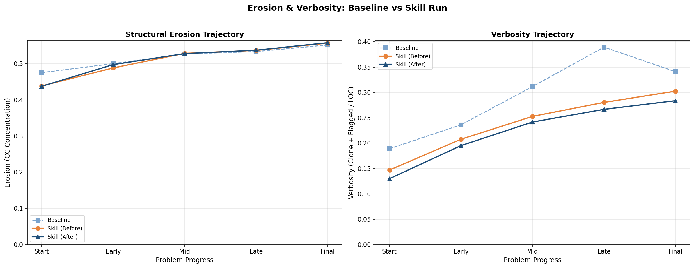
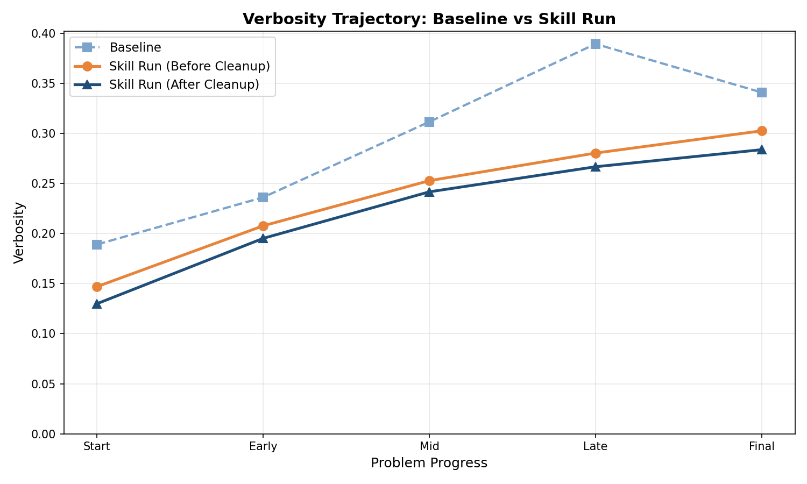
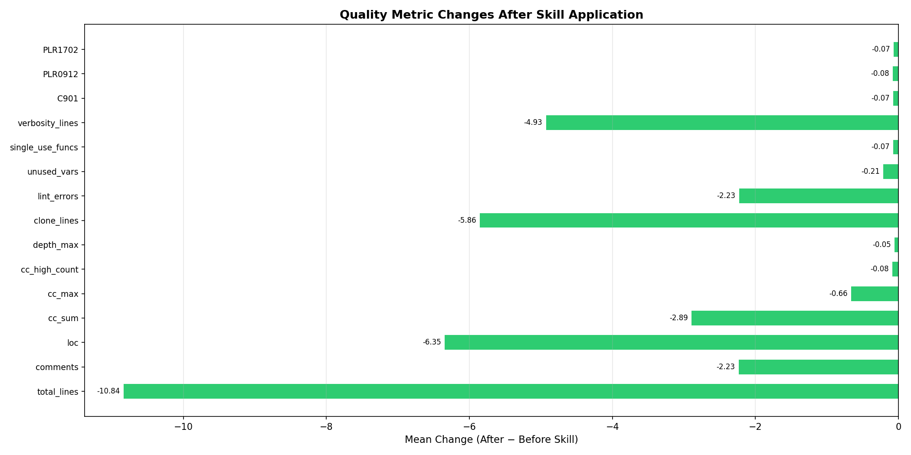
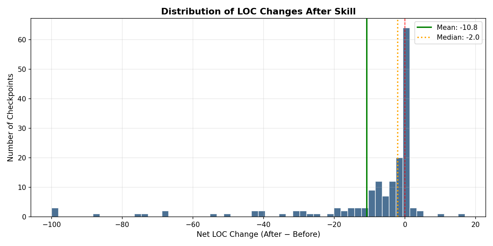
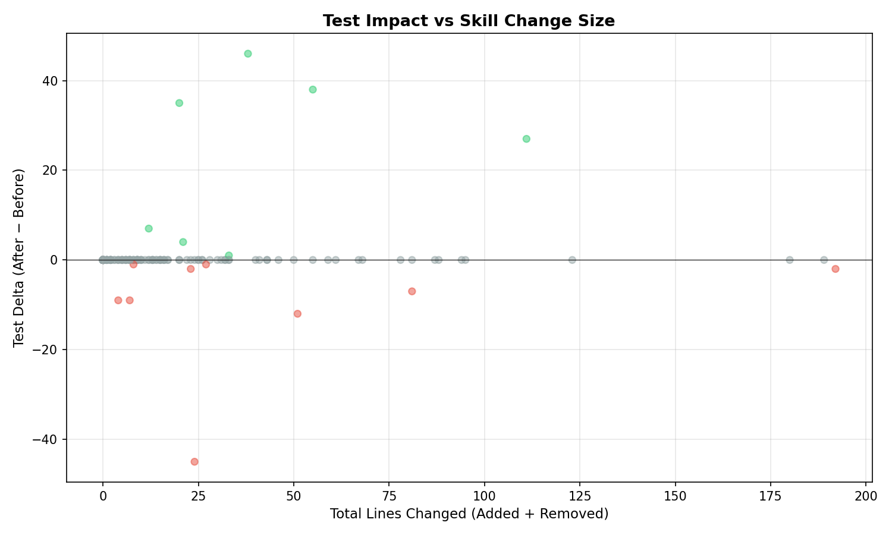
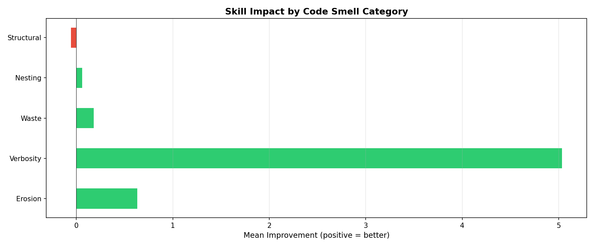

# Slop Analysis: Before → After Skill Deep Dive

## 1. Overview

Analyzed **175 checkpoints** across Pangu review_refactor runs.

### Test Impact Summary

| | Count | % |
|---|---:|---:|
| Same | 159 | 90% |
| 🟢 Improved | 7 | 4% |
| 🔴 Worsened | 9 | 5% |

## 2. Code Smell Analysis by Category

### Erosion (TMB/HCC/RFC)

| Metric | Mean Δ | Median Δ | Improved % | Worsened % |
|--------|--------|----------|------------|------------|
| cc_max | -0.659 | +0.0 | 11% | 0% |
| cc_sum | -2.892 | +0.0 | 31% | 2% |
| cc_concentration | +0.001 | +0.0 | 21% | 13% |
| cc_high_count | -0.084 | +0.0 | 7% | 0% |
| C901 | -0.072 | +0.0 | 7% | 0% |
| PLR0912 | -0.078 | +0.0 | 7% | 0% |

### Verbosity (PAU/Duplication)

| Metric | Mean Δ | Median Δ | Improved % | Worsened % |
|--------|--------|----------|------------|------------|
| clone_lines | -5.856 | +0.0 | 16% | 2% |
| clone_ratio | -0.007 | +0.0 | 20% | 37% |
| comments | -2.234 | +0.0 | 36% | 1% |
| verbosity_lines | -4.928 | +0.0 | 14% | 2% |
| total_lines | -10.838 | -2.0 | 58% | 5% |
| loc | -6.347 | -1.0 | 51% | 6% |

### Waste (Dead Code)

| Metric | Mean Δ | Median Δ | Improved % | Worsened % |
|--------|--------|----------|------------|------------|
| unused_vars | -0.210 | +0.0 | 13% | 1% |
| single_use_funcs | -0.072 | +0.0 | 8% | 3% |
| trivial_wrappers | +0.000 | +0.0 | 0% | 0% |
| F401 | -0.443 | +0.0 | 25% | 1% |

### Nesting

| Metric | Mean Δ | Median Δ | Improved % | Worsened % |
|--------|--------|----------|------------|------------|
| depth_max | -0.054 | +0.0 | 3% | 0% |
| PLR1702 | -0.066 | +0.0 | 4% | 0% |

### Structural

| Metric | Mean Δ | Median Δ | Improved % | Worsened % |
|--------|--------|----------|------------|------------|
| func_count | -0.174 | +0.0 | 5% | 14% |
| classes | -0.006 | +0.0 | 1% | 2% |
| methods | -0.048 | +0.0 | 2% | 4% |
| file_count | +0.000 | +0.0 | 0% | 0% |

## 3. Source Code Changes

- **Checkpoints analyzed**: 167
- **No code change**: 52 (31%)
- **Small change (≤20 lines)**: 70 (41%)
- **Large change (>20 lines)**: 45 (26%)
- **Mean net LOC change**: -10.8
- **Total lines removed**: 2515
- **Total lines added**: 708

## 4. Skill Agent Behavior

### Tool Usage

| Tool | Count |
|------|------:|
| TodoWrite | 63 |
| Grep | 16 |
| Read | 11 |
| Edit | 10 |
| Bash | 7 |

- Mean turns per skill run: 16.1
- Mean tool calls per skill run: 0.6

## 5. Erosion & Verbosity Trajectories

### Erosion by Phase

| Phase | Baseline | Skill (Before) | Skill (After) |
|-------|----------|----------------|---------------|
| Start | 0.475 | 0.439 | 0.437 |
| Early | 0.500 | 0.488 | 0.498 |
| Mid | 0.527 | 0.529 | 0.528 |
| Late | 0.534 | 0.537 | 0.537 |
| Final | 0.552 | 0.557 | 0.558 |

## 6. Slop Rebound Analysis

Cases where LOC increased >10% between after-skill and next checkpoint's before-skill: **107**

| Problem | CP → CP | After LOC | Next Before LOC | Rebound |
|---------|---------|-----------|-----------------|--------|
| textdrop | cp2→cp3 | 630 | 154057 | +24353% |
| code_search | cp2→cp3 | 274 | 1088 | +297% |
| recli | cp6→cp7 | 539 | 1906 | +254% |
| test_translator | cp2→cp3 | 1356 | 4718 | +248% |
| forge | cp3→cp4 | 679 | 1959 | +189% |
| mvvault | cp2→cp3 | 669 | 1905 | +185% |
| etl_pipeline | cp1→cp2 | 284 | 804 | +183% |
| xjq | cp1→cp2 | 81 | 227 | +180% |
| dynamic_buffer | cp2→cp3 | 2066 | 5713 | +177% |
| database_migration | cp1→cp2 | 364 | 960 | +164% |

## 7. Cost-Benefit Analysis

- Total skill cost: $36.61
- Tests gained: +158
- Tests lost: -88
- Net test change: +70
- Cost per net test gained: $0.52

## 8. Failure Mode Analysis

Total regressions: 9

- **large_removal**: 3 cases
  - env_manager/checkpoint_3: tests -2, LOC -192
  - meshctl/checkpoint_5: tests -12, LOC -51
  - xjq/checkpoint_2: tests -7, LOC -43
- **medium_change**: 4 cases
  - datagate/checkpoint_2: tests -2, LOC -17
  - forge/checkpoint_8: tests -9, LOC -7
  - meshctl/checkpoint_2: tests -1, LOC -9
- **small_change**: 2 cases
  - meshctl/checkpoint_6: tests -9, LOC -4
  - trajectory_api/checkpoint_1: tests -1, LOC +0

## 9. Case Studies

### Top Improvements

| Problem/CP | Tests Δ | LOC Δ | Added | Removed |
|------------|---------|-------|-------|--------|
| file_merger/checkpoint_4 | +46 | -14 | +12 | -26 |
| recli/checkpoint_7 | +38 | -35 | +10 | -45 |
| code_search/checkpoint_4 | +35 | +4 | +12 | -8 |
| env_manager/checkpoint_4 | +27 | -111 | +0 | -111 |
| migrate_configs/checkpoint_1 | +7 | -8 | +2 | -10 |

### Top Regressions

| Problem/CP | Tests Δ | LOC Δ | Added | Removed |
|------------|---------|-------|-------|--------|
| meshctl/checkpoint_3 | -45 | -14 | +5 | -19 |
| meshctl/checkpoint_5 | -12 | -51 | +0 | -51 |
| forge/checkpoint_8 | -9 | -7 | +0 | -7 |
| meshctl/checkpoint_6 | -9 | -4 | +0 | -4 |
| xjq/checkpoint_2 | -7 | -43 | +19 | -62 |

## Charts

