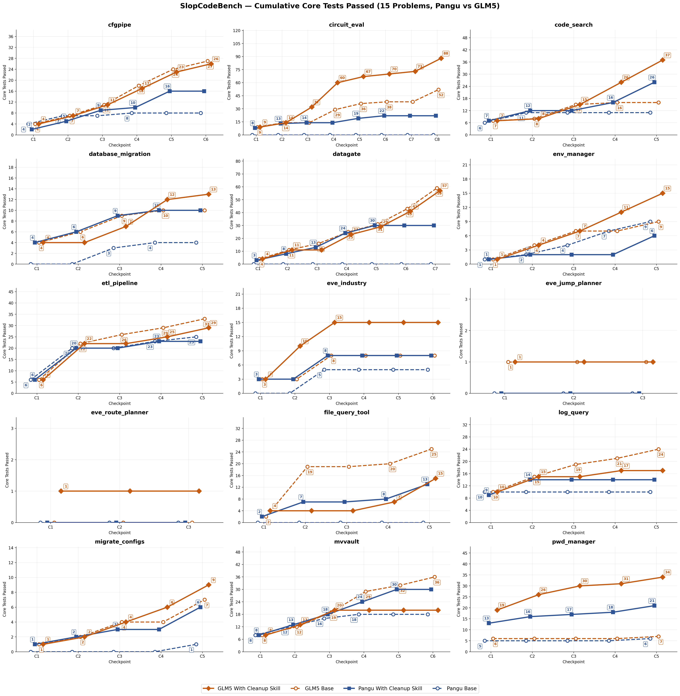

# SlopCodeBench: 15-Problem Summary — Pangu vs GLM5, Base vs With Cleanup Skill

## Overview

15 problems, 4 conditions per problem:
- **Blue dashed** = Pangu Base | **Blue solid** = Pangu With Cleanup Skill
- **Orange dashed** = GLM5 Base | **Orange solid** = GLM5 With Cleanup Skill

## Performance Chart



## Aggregate

### Cumulative Core Tests Passed

| Problem | Pangu Base | Pangu Skill | GLM5 Base | GLM5 Skill | Best |
|---------|-----------|-------------|-----------|------------|------|
| cfgpipe | 8 | 16 | 27 | 26 | GLM5 Base |
| circuit_eval | 0 | 22 | 52 | **88** | GLM5 Skill |
| code_search | 11 | 26 | 16 | **37** | GLM5 Skill |
| database_migration | 4 | 10 | 10 | **13** | GLM5 Skill |
| datagate | 0 | 30 | **59** | 57 | GLM5 Base |
| env_manager | 9 | 6 | 9 | **15** | GLM5 Skill |
| etl_pipeline | 25 | 23 | **33** | 29 | GLM5 Base |
| eve_industry | 5 | 8 | 8 | **15** | GLM5 Skill |
| eve_jump_planner | 0 | 0 | 1 | 1 | GLM5 |
| eve_route_planner | 0 | 0 | 0 | 1 | GLM5 Skill |
| file_query_tool | 0 | 13 | **25** | 15 | GLM5 Base |
| log_query | 10 | 14 | **24** | 17 | GLM5 Base |
| migrate_configs | 1 | 6 | 7 | **9** | GLM5 Skill |
| mvvault | 18 | **30** | 36 | 20 | GLM5 Base |
| pwd_manager | 6 | 21 | 7 | **34** | GLM5 Skill |
| **Total** | **97** | **225** | **314** | **377** | **GLM5 Skill** |

### Skill Improvement per Model

| Model | Base | Skill | Δ | % |
|-------|------|-------|---|---|
| **Pangu** | 97 | 225 | **+128** | **+132%** |
| **GLM5** | 314 | 377 | **+63** | **+20%** |

## Key Findings

1. **GLM5 passes more core tests than Pangu**: GLM5 Skill 377 vs Pangu Skill 225 across 15 problems
2. **Cleanup skill improves Pangu by +132%**: Base 97 → Skill 225 (+128)
3. **Cleanup skill improves GLM5 by +20%**: Base 314 → Skill 377 (+63)
4. **Pangu benefits more from skill**: weaker baseline (+132%) sees larger relative improvement than stronger baseline (+20%)
5. **Biggest Pangu gains**: datagate +30, circuit_eval +22, code_search +15, pwd_manager +15, file_query_tool +13, mvvault +12
6. **Biggest GLM5 gains**: circuit_eval +36, pwd_manager +27, code_search +21, eve_industry +7, env_manager +6

---

## Run Paths

### Pangu

```
cfgpipe:
  baseline: outputs/pangu/claude_code-2.0.51_baseline_20260603T1458/cfgpipe/
  review:   outputs/pangu/claude_code-2.0.51_review_refactor_20260602T0203/cfgpipe/

circuit_eval:
  baseline: outputs/pangu/claude_code-2.0.51_baseline_20260603T2011/circuit_eval/
  review:   outputs/pangu/claude_code-2.0.51_review_refactor_20260604T1409/circuit_eval/

code_search:
  baseline: outputs/pangu/claude_code-2.0.51_baseline_20260603T0121/code_search/
  review:   outputs/pangu/claude_code-2.0.51_review_refactor_20260602T0203/code_search/

database_migration:
  baseline: outputs/pangu/claude_code-2.0.51_baseline_20260604T1405/database_migration/
  review:   outputs/pangu/claude_code-2.0.51_review_refactor_20260603T2011/database_migration/

datagate:
  baseline: outputs/pangu/claude_code-2.0.51_baseline_20260603T2011/datagate/
  review:   outputs/pangu/claude_code-2.0.51_review_refactor_20260603T2011/datagate/

env_manager:
  baseline: outputs/pangu/claude_code-2.0.51_baseline_20260603T2011/env_manager/
  review:   outputs/pangu/claude_code-2.0.51_review_refactor_20260604T1409/env_manager/

etl_pipeline:
  baseline: outputs/pangu/claude_code-2.0.51_baseline_20260603T1458/etl_pipeline/
  review:   outputs/pangu/claude_code-2.0.51_review_refactor_20260602T0203/etl_pipeline/

eve_industry:
  baseline: outputs/pangu/claude_code-2.0.51_baseline_20260603T1458/eve_industry/
  review:   outputs/pangu/claude_code-2.0.51_review_refactor_20260602T0203/eve_industry/

eve_jump_planner:
  baseline: outputs/pangu/claude_code-2.0.51_baseline_20260603T1458/eve_jump_planner/
  review:   outputs/pangu/claude_code-2.0.51_review_refactor_20260602T0203/eve_jump_planner/

eve_route_planner:
  baseline: outputs/pangu/claude_code-2.0.51_baseline_20260604T1405/eve_route_planner/
  review:   outputs/pangu/claude_code-2.0.51_review_refactor_20260604T1409/eve_route_planner/

file_query_tool:
  baseline: outputs/pangu/claude_code-2.0.51_baseline_20260604T1405/file_query_tool/
  review:   outputs/pangu/claude_code-2.0.51_review_refactor_20260605T1442/file_query_tool/

log_query:
  baseline: outputs/pangu/claude_code-2.0.51_baseline_20260604T1405/log_query/
  review:   outputs/pangu/claude_code-2.0.51_review_refactor_20260605T1442/log_query/

migrate_configs:
  baseline: outputs/pangu/claude_code-2.0.51_baseline_20260605T1442/migrate_configs/
  review:   outputs/pangu/claude_code-2.0.51_review_refactor_20260605T1442/migrate_configs/

mvvault:
  baseline: outputs/pangu/claude_code-2.0.51_baseline_20260605T1442/mvvault/
  review:   outputs/pangu/claude_code-2.0.51_review_refactor_20260605T1442/mvvault/

pwd_manager:
  baseline: outputs/pangu/claude_code-2.0.51_baseline_20260605T1442/pwd_manager/
  review:   outputs/pangu/claude_code-2.0.51_review_refactor_20260605T1442/pwd_manager/
```

### GLM5

```
cfgpipe:
  baseline: outputs/glm-5-kimi/claude_code-2.0.51_just-solve_none_20260601T2147/cfgpipe/
  review:   outputs/glm-5-kimi/claude_code-2.0.51_review_refactor_20260602T2029/cfgpipe/

circuit_eval:
  baseline: outputs/glm-5-kimi/claude_code-2.0.51_baseline_20260608T1722/circuit_eval/
  review:   outputs/glm-5-kimi/claude_code-2.0.51_review_refactor_20260608T1722/circuit_eval/

code_search:
  baseline: outputs/glm-5-kimi/claude_code-2.0.51_baseline_20260604T2240/code_search/
  review:   outputs/glm-5-kimi/claude_code-2.0.51_review_refactor_20260604T2242/code_search/

database_migration:
  baseline: outputs/glm-5-kimi/claude_code-2.0.51_baseline_20260604T2240/database_migration/
  review:   outputs/glm-5-kimi/claude_code-2.0.51_review_refactor_20260604T2242/database_migration/

datagate:
  baseline: outputs/glm-5-kimi/claude_code-2.0.51_baseline_20260604T2240/datagate/
  review:   outputs/glm-5-kimi/claude_code-2.0.51_review_refactor_20260605T1540/datagate/

env_manager:
  baseline: outputs/glm-5-kimi/claude_code-2.0.51_baseline_20260604T2240/env_manager/
  review:   outputs/glm-5-kimi/claude_code-2.0.51_review_refactor_20260604T2242/env_manager/

etl_pipeline:
  baseline: outputs/glm-5-kimi/claude_code-2.0.51_baseline_20260604T2240/etl_pipeline/
  review:   outputs/glm-5-kimi/claude_code-2.0.51_review_refactor_20260605T1540/etl_pipeline/

eve_industry:
  baseline: outputs/glm-5-kimi/claude_code-2.0.51_baseline_20260604T2240/eve_industry/
  review:   outputs/glm-5-kimi/claude_code-2.0.51_review_refactor_20260604T2242/eve_industry/

eve_jump_planner:
  baseline: outputs/glm-5-kimi/claude_code-2.0.51_baseline_20260604T2240/eve_jump_planner/
  review:   outputs/glm-5-kimi/claude_code-2.0.51_review_refactor_20260605T1540/eve_jump_planner/

eve_route_planner:
  baseline: outputs/glm-5-kimi/claude_code-2.0.51_baseline_20260604T2240/eve_route_planner/
  review:   outputs/glm-5-kimi/claude_code-2.0.51_review_refactor_20260605T1540/eve_route_planner/

file_query_tool:
  baseline: outputs/glm-5-kimi/claude_code-2.0.51_baseline_20260608T1722/file_query_tool/
  review:   outputs/glm-5-kimi/claude_code-2.0.51_review_refactor_20260608T1722/file_query_tool/

log_query:
  baseline: outputs/glm-5-kimi/claude_code-2.0.51_baseline_20260608T1722/log_query/
  review:   outputs/glm-5-kimi/claude_code-2.0.51_review_refactor_20260608T1722/log_query/

migrate_configs:
  baseline: outputs/glm-5-kimi/claude_code-2.0.51_baseline_20260608T1722/migrate_configs/
  review:   outputs/glm-5-kimi/claude_code-2.0.51_review_refactor_20260608T1722/migrate_configs/

mvvault:
  baseline: outputs/glm-5-kimi/claude_code-2.0.51_baseline_20260608T1722/mvvault/
  review:   outputs/glm-5-kimi/claude_code-2.0.51_review_refactor_20260608T1722/mvvault/

pwd_manager:
  baseline: outputs/glm-5-kimi/claude_code-2.0.51_baseline_20260608T1722/pwd_manager/
  review:   outputs/glm-5-kimi/claude_code-2.0.51_review_refactor_20260608T1722/pwd_manager/
```
