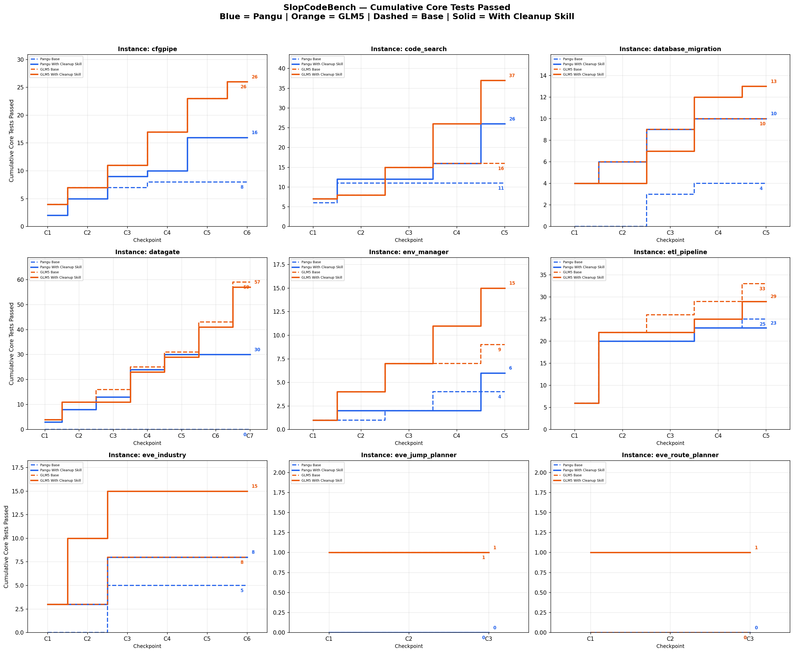
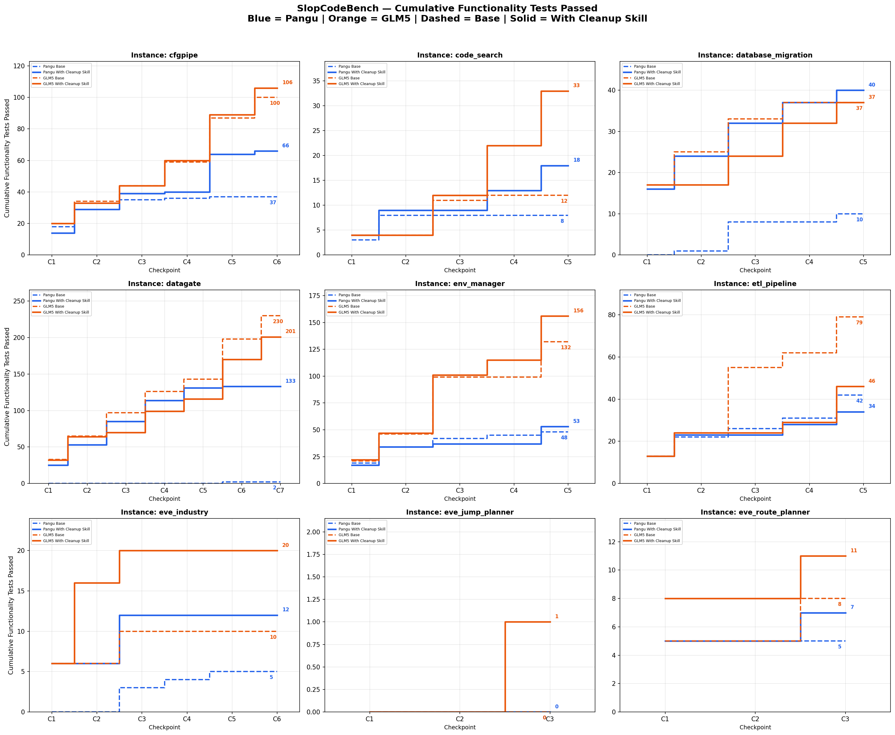
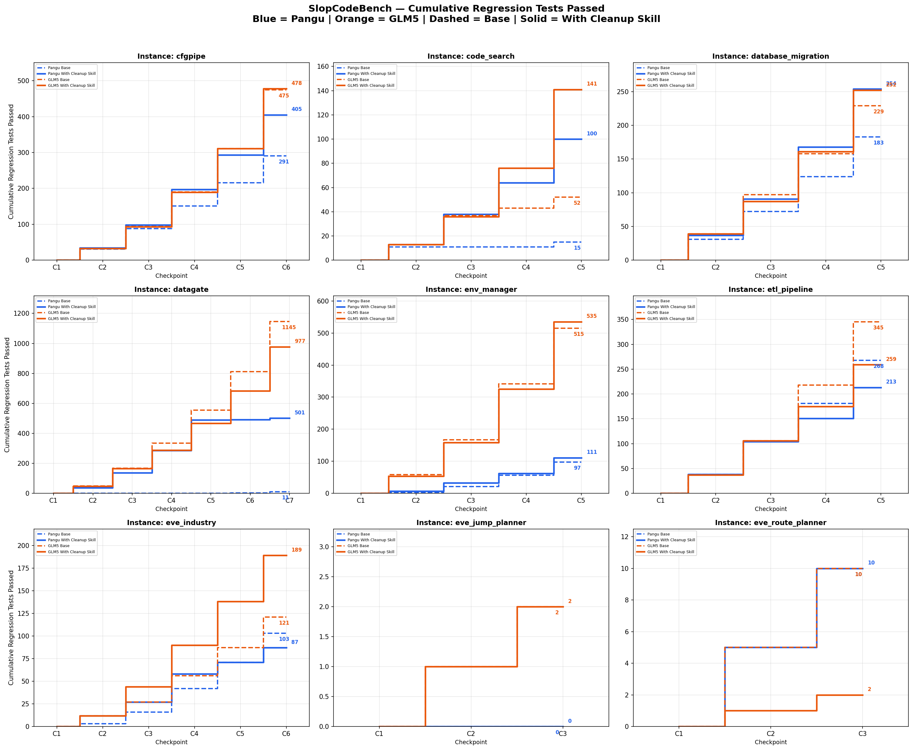
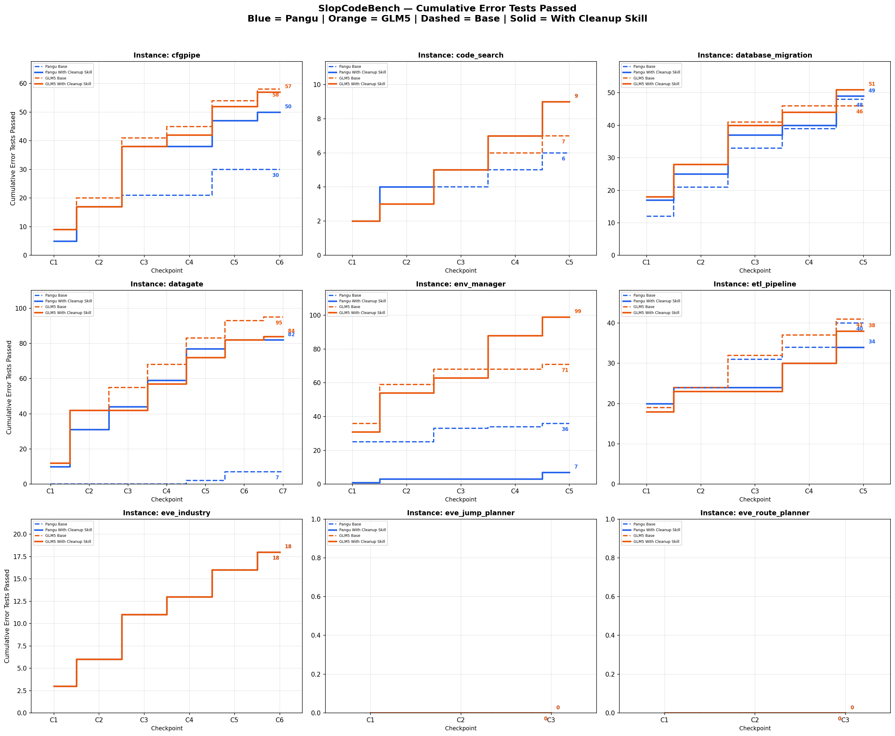
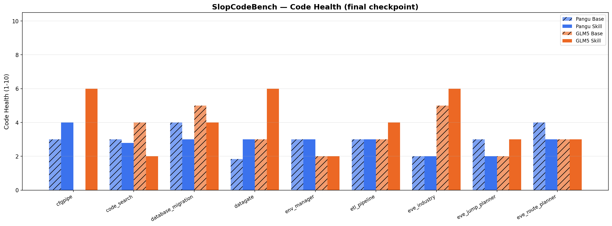

# SlopCodeBench: 9-Problem Summary — Pangu vs GLM5, Base vs With Cleanup Skill

## Overview

9 problems, 45 checkpoints per model, 4 conditions:
- **Blue dashed** = Pangu Base | **Blue solid** = Pangu With Cleanup Skill
- **Orange dashed** = GLM5 Base | **Orange solid** = GLM5 With Cleanup Skill

## Performance Charts (Cumulative Tests Passed)

## Code Health (final checkpoint)

| Problem | Pangu Base | Pangu Skill | GLM5 Base | GLM5 Skill |
|---------|-----------|-------------|-----------|------------|
| cfgpipe | 3.0 | 4.0 | N/A | 6.0 |
| code_search | 3.0 | 2.79 | 4.0 | 2.0 |
| database_migration | 4.0 | 3.0 | 5.0 | 4.0 |
| datagate | 1.83 | 3.0 | 3.0 | 6.0 |
| env_manager | 3.0 | 3.0 | 2.0 | 2.0 |
| etl_pipeline | 3.0 | 3.0 | 3.0 | 4.0 |
| eve_industry | 2.0 | 2.0 | 5.0 | 6.0 |
| eve_jump_planner | 3.0 | 2.0 | 2.0 | 3.0 |
| eve_route_planner | 4.0 | 3.0 | 3.0 | 3.0 |

## Aggregate

### Cumulative Core Tests Passed (total across all checkpoints)

| Problem | Pangu Base | Pangu Skill | GLM5 Base | GLM5 Skill | Best |
|---------|-----------|-------------|-----------|------------|------|
| cfgpipe | 8 | 16 | 26 | 26 | GLM5 |
| code_search | 11 | 26 | 16 | **37** | GLM5 Skill |
| database_migration | 4 | 10 | 10 | **13** | GLM5 Skill |
| datagate | 0 | 30 | **59** | 57 | GLM5 Base |
| env_manager | 4 | 6 | 9 | **15** | GLM5 Skill |
| etl_pipeline | 25 | 23 | **33** | 29 | GLM5 Base |
| eve_industry | 5 | 8 | 8 | **15** | GLM5 Skill |
| eve_jump_planner | 0 | 0 | 1 | 1 | GLM5 |
| eve_route_planner | 0 | 0 | 0 | 1 | GLM5 Skill |
| **Total** | **57** | **119** | **162** | **194** | **GLM5 Skill** |

### Baseline vs Skill After (per model)

| Model | Checkpoints | Skill After wins | Baseline wins | Tie |
|-------|-------------|-----------------|--------------|-----|
| Pangu | 45 | **28 (62%)** | 9 (20%) | 8 (18%) |
| GLM5 | 45 | 16 (36%) | **19 (42%)** | 10 (22%) |

### Skill Effect: Before → After

#### Pangu (45 checkpoints): 91% same, 4% improved, 4% worsened

| Problem | Ckpt | Change |
|---------|------|--------|
| 🟢 code_search | C4 | Core +4, Func +4, Regr +26, Error +1 (bug fix, +35 tests) |
| 🟢 env_manager | C4 | Regr +27 (fixed regression tests) |
| 🔴 datagate | C2 | Error -2 |
| 🔴 env_manager | C3 | Func -1, Regr -1 |

#### GLM5 (45 checkpoints): 100% same

No test score changes from skill across all 45 checkpoints.

---

## Per-Problem Detail (Baseline vs After + Before vs After)

### cfgpipe (6 ckpts)

| Ckpt | Model | Baseline | Skill After | Base→After | Before→After |
|------|-------|----------|-------------|------------|--------------|
| C1 | Pangu | C=4/4✅ (31) | C=2/4❌ (21) | 🔴C-2, F-4, E-4 | = |
| C1 | GLM5 | C=4/4✅ (33) | C=4/4✅ (33) | = | = |
| C2 | Pangu | C=3/3✅ (57) | C=3/3✅ (64) | 🟢R+3, E+4 | = |
| C2 | GLM5 | C=3/3✅ (61) | C=3/3✅ (57) | 🔴F-1, E-3 | = |
| C3 | Pangu | C=0/4❌ (63) | C=4/4✅ (99) | 🟢C+4, F+8, R+7, E+17 | = |
| C3 | GLM5 | C=4/4✅ (96) | C=4/4✅ (96) | 🟢F+1, 🔴R-1 | = |
| C4 | Pangu | C=1/7❌ (65) | C=1/7❌ (101) | 🟢R+36 | = |
| C4 | GLM5 | C=6/7❌ (121) | C=6/7❌ (122) | 🟢F+1 | = |
| C5 | Pangu | C=0/6❌ (75) | C=6/6✅ (135) | 🟢C+6, F+23, R+31 | = |
| C5 | GLM5 | C=6/6✅ (164) | C=6/6✅ (167) | 🟢F+1, R+1, E+1 | = |
| C6 | Pangu | C=0/3❌ (75) | C=0/3❌ (117) | 🟢F+2, R+37, E+3 | = |
| C6 | GLM5 | C=3/3✅ (184) | C=3/3✅ (192) | 🟢F+4, R+3, E+1 | = |

### code_search (5 ckpts)

| Ckpt | Model | Baseline | Skill After | Base→After | Before→After |
|------|-------|----------|-------------|------------|--------------|
| C1 | Pangu | C=6/7❌ (11) | C=7/7✅ (13) | 🟢C+1, F+1 | = |
| C1 | GLM5 | C=7/7✅ (13) | C=7/7✅ (13) | = | = |
| C2 | Pangu | C=5/5✅ (23) | C=5/5✅ (25) | 🟢R+2 | = |
| C2 | GLM5 | C=1/5❌ (15) | C=1/5❌ (15) | = | = |
| C3 | Pangu | C=0/8❌ (0) | C=0/8❌ (26) | 🟢R+25, E+1 | = |
| C3 | GLM5 | C=7/8❌ (40) | C=7/8❌ (40) | 🟢F+1, 🔴R-1 | = |
| C4 | Pangu | C=0/14❌ (1) | C=4/14❌ (36) | 🟢C+4, F+4, R+26, E+1 | 🟢C+4, F+4, R+26, E+1 |
| C4 | GLM5 | C=1/14❌ (9) | C=11/14❌ (63) | 🟢C+10, F+9, R+34, E+1 | = |
| C5 | Pangu | C=0/13❌ (5) | C=10/13❌ (53) | 🟢C+10, F+5, R+32, E+1 | = |
| C5 | GLM5 | C=0/13❌ (10) | C=11/13❌ (89) | 🟢C+11, F+11, R+56, E+1 | = |

### database_migration (5 ckpts)

| Ckpt | Model | Baseline | Skill After | Base→After | Before→After |
|------|-------|----------|-------------|------------|--------------|
| C1 | Pangu | C=0/4❌ (12) | C=4/4✅ (37) | 🟢C+4, F+16, E+5 | = |
| C1 | GLM5 | C=4/4✅ (39) | C=4/4✅ (39) | = | = |
| C2 | Pangu | C=0/3❌ (41) | C=2/3❌ (55) | 🟢C+2, F+7, R+6, 🔴E-1 | = |
| C2 | GLM5 | C=2/3❌ (59) | C=0/3❌ (49) | 🔴C-2, F-8 | = |
| C3 | Pangu | C=3/3✅ (63) | C=3/3✅ (77) | 🟢F+1, R+13 | = |
| C3 | GLM5 | C=3/3✅ (82) | C=3/3✅ (70) | 🔴F-1, R-10, E-1 | = |
| C4 | Pangu | C=1/6❌ (59) | C=1/6❌ (86) | 🟢F+5, R+25, 🔴E-3 | = |
| C4 | GLM5 | C=1/6❌ (71) | C=5/6❌ (91) | 🟢C+4, F+4, R+13, 🔴E-1 | = |
| C5 | Pangu | C=0/3❌ (70) | C=0/3❌ (98) | 🟢F+1, R+27 | = |
| C5 | GLM5 | C=0/3❌ (71) | C=1/3❌ (104) | 🟢C+1, F+5, R+20, E+7 | = |

### datagate (7 ckpts)

| Ckpt | Model | Baseline | Skill After | Base→After | Before→After |
|------|-------|----------|-------------|------------|--------------|
| C1 | Pangu | C=0/4❌ (0) | C=3/4❌ (38) | 🟢C+3, F+25, E+10 | = |
| C1 | GLM5 | C=4/4✅ (49) | C=4/4✅ (48) | 🔴F-1 | = |
| C2 | Pangu | C=0/9❌ (0) | C=5/9❌ (92) | 🟢C+5, F+28, R+38, E+21 | 🔴E-2 |
| C2 | GLM5 | C=7/9❌ (118) | C=7/9❌ (117) | 🔴R-1 | = |
| C3 | Pangu | C=0/5❌ (0) | C=5/5✅ (149) | 🟢C+5, F+32, R+99, E+13 | = |
| C3 | GLM5 | C=5/5✅ (168) | C=0/5❌ (123) | 🔴C-5, F-26, R-1, E-13 | = |
| C4 | Pangu | C=0/12❌ (0) | C=11/12❌ (204) | 🟢C+11, F+29, R+149, E+15 | = |
| C4 | GLM5 | C=9/12❌ (219) | C=12/12✅ (179) | 🟢C+3, 🔴R-45, 🟢E+2 | = |
| C5 | Pangu | C=0/6❌ (2) | C=6/6✅ (245) | 🟢C+6, F+17, R+204, E+16 | = |
| C5 | GLM5 | C=6/6✅ (257) | C=6/6✅ (217) | 🔴R-40 | = |
| C6 | Pangu | C=0/12❌ (9) | C=0/12❌ (9) | = | = |
| C6 | GLM5 | C=12/12✅ (334) | C=12/12✅ (293) | 🔴F-1, R-40 | = |
| C7 | Pangu | C=0/16❌ (9) | C=0/16❌ (9) | = | = |
| C7 | GLM5 | C=16/16✅ (384) | C=16/16✅ (342) | 🔴F-1, R-41 | = |

### env_manager (5 ckpts)

| Ckpt | Model | Baseline | Skill After | Base→After | Before→After |
|------|-------|----------|-------------|------------|--------------|
| C1 | Pangu | C=1/2❌ (45) | C=1/2❌ (19) | 🔴F-2, E-24 | = |
| C1 | GLM5 | C=1/2❌ (58) | C=1/2❌ (54) | 🟢F+1, 🔴E-5 | = |
| C2 | Pangu | C=0/3❌ (18) | C=1/3❌ (27) | 🟢C+1, F+2, R+4, E+2 | = |
| C2 | GLM5 | C=3/3✅ (109) | C=3/3✅ (105) | 🔴R-4 | = |
| C3 | Pangu | C=1/3❌ (35) | C=0/3❌ (29) | 🔴C-1, F-5, 🟢R+8, 🔴E-8 | 🔴F-1, R-1 |
| C3 | GLM5 | C=3/3✅ (174) | C=3/3✅ (170) | 🟢F+1, 🔴R-5 | = |
| C4 | Pangu | C=2/4❌ (41) | C=0/4❌ (29) | 🔴C-2, F-3, R-6, E-1 | 🟢R+27 |
| C4 | GLM5 | C=0/4❌ (174) | C=4/4✅ (210) | 🟢C+4, F+14, 🔴R-7, E+25 | = |
| C5 | Pangu | C=0/4❌ (46) | C=4/4✅ (73) | 🟢C+4, F+13, R+8, E+2 | = |
| C5 | GLM5 | C=2/4❌ (212) | C=4/4✅ (266) | 🟢C+2, F+8, R+36, E+8 | = |

### etl_pipeline (5 ckpts)

| Ckpt | Model | Baseline | Skill After | Base→After | Before→After |
|------|-------|----------|-------------|------------|--------------|
| C1 | Pangu | C=6/6✅ (38) | C=6/6✅ (39) | 🟢E+1 | = |
| C1 | GLM5 | C=6/6✅ (38) | C=6/6✅ (37) | 🔴E-1 | = |
| C2 | Pangu | C=14/16❌ (66) | C=14/16❌ (66) | 🟢F+1, 🔴E-1 | = |
| C2 | GLM5 | C=16/16✅ (69) | C=16/16✅ (69) | = | = |
| C3 | Pangu | C=0/4❌ (77) | C=0/4❌ (66) | 🔴F-4, E-7 | = |
| C3 | GLM5 | C=4/4✅ (112) | C=0/4❌ (69) | 🔴C-4, F-31, E-8 | = |
| C4 | Pangu | C=3/3✅ (88) | C=3/3✅ (61) | 🔴R-30, 🟢E+3 | = |
| C4 | GLM5 | C=3/3✅ (127) | C=3/3✅ (84) | 🔴F-2, R-43, 🟢E+2 | = |
| C5 | Pangu | C=2/4❌ (106) | C=0/4❌ (72) | 🔴C-2, F-5, R-25, E-2 | = |
| C5 | GLM5 | C=4/4✅ (152) | C=4/4✅ (113) | 🔴R-43, 🟢E+4 | = |

### eve_industry (6 ckpts)

| Ckpt | Model | Baseline | Skill After | Base→After | Before→After |
|------|-------|----------|-------------|------------|--------------|
| C1 | Pangu | C=0/3❌ (3) | C=3/3✅ (12) | 🟢C+3, F+6 | = |
| C1 | GLM5 | C=3/3✅ (12) | C=3/3✅ (12) | = | = |
| C2 | Pangu | C=0/7❌ (6) | C=0/7❌ (15) | 🟢R+9 | = |
| C2 | GLM5 | C=0/7❌ (15) | C=7/7✅ (32) | 🟢C+7, F+10 | = |
| C3 | Pangu | C=5/5✅ (26) | C=5/5✅ (31) | 🟢F+3, R+2 | = |
| C3 | GLM5 | C=5/5✅ (29) | C=5/5✅ (46) | 🟢R+17 | = |
| C4 | Pangu | C=0/2❌ (29) | C=0/2❌ (33) | 🔴F-1, 🟢R+5 | = |
| C4 | GLM5 | C=0/2❌ (31) | C=0/2❌ (48) | 🟢R+17 | = |
| C5 | Pangu | C=0/3❌ (33) | C=0/3❌ (16) | 🔴F-1, R-16 | = |
| C5 | GLM5 | C=0/3❌ (34) | C=0/3❌ (51) | 🟢R+17 | = |
| C6 | Pangu | C=0/2❌ (34) | C=0/2❌ (18) | 🔴R-16 | = |
| C6 | GLM5 | C=0/2❌ (36) | C=0/2❌ (53) | 🟢R+17 | = |

### eve_jump_planner (3 ckpts)

| Ckpt | Model | Baseline | Skill After | Base→After | Before→After |
|------|-------|----------|-------------|------------|--------------|
| C1 | Pangu | C=0/2❌ (0) | C=0/2❌ (0) | = | = |
| C1 | GLM5 | C=1/2❌ (1) | C=1/2❌ (1) | = | = |
| C2 | Pangu | C=0/1❌ (0) | C=0/1❌ (0) | = | = |
| C2 | GLM5 | C=0/1❌ (1) | C=0/1❌ (1) | = | = |
| C3 | Pangu | C=0/1❌ (0) | C=0/1❌ (0) | = | = |
| C3 | GLM5 | C=0/1❌ (1) | C=0/1❌ (2) | 🟢F+1 | = |

### eve_route_planner (3 ckpts)

| Ckpt | Model | Baseline | Skill After | Base→After | Before→After |
|------|-------|----------|-------------|------------|--------------|
| C1 | Pangu | C=0/1❌ (5) | C=0/1❌ (5) | = | = |
| C1 | GLM5 | C=0/1❌ (5) | C=1/1✅ (9) | 🟢C+1, F+3 | = |
| C2 | Pangu | C=0/2❌ (5) | C=0/2❌ (5) | = | = |
| C2 | GLM5 | C=0/2❌ (5) | C=0/2❌ (1) | 🔴R-4 | = |
| C3 | Pangu | C=0/1❌ (5) | C=0/1❌ (7) | 🟢F+2 | = |
| C3 | GLM5 | C=0/1❌ (8) | C=0/1❌ (4) | 🔴R-4 | = |

---

## Key Findings

1. **GLM5 passes more core tests than Pangu**: GLM5 With Skill cumulative core 194 vs Pangu With Skill 119 across 9 problems
2. **Cleanup skill improves Pangu core tests by +109% over baseline**: Pangu Base 57 → Pangu With Skill 119 cumulative core tests (+62, +109%)
3. **Cleanup skill improves GLM5 core tests by +20% over baseline**: GLM5 Base 162 → GLM5 With Skill 194 cumulative core tests (+32, +20%)
4. **Cleanup skill is safe (Before→After)**: Unchanged in 91% (Pangu) and 100% (GLM5) of checkpoints — skill rarely breaks tests
5. **Cleanup skill occasionally fixes bugs**: Pangu code_search/C4 gained +35 tests, env_manager/C4 gained +27 regression tests from small code edits
6. **Cleanup skill occasionally causes minor regressions**: Pangu datagate/C2 lost 2 error tests, env_manager/C3 lost 1 func + 1 regr test
7. **Pangu benefits more from cleanup skill**: Pangu gains +109% core tests vs GLM5 +20% — weaker baseline models see larger relative improvement
8. **Cost**: Pangu is more cost-efficient ($214-244 total) vs GLM5 ($306-331)
9. **Code health does not correlate with core test performance**: Higher health scores do not predict more core tests passed
